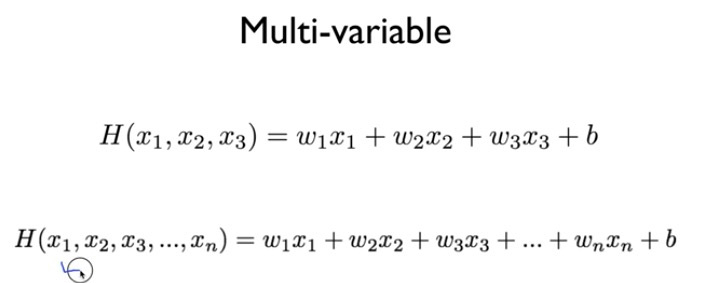

# Linear Regression

### Supervised / Unsupervised learning

* supervised learning(지도 학습) : learning with labeled examples - training set
  - regression
  - classification(binary or multi-label)

* unsupervised learning(자율 학습) : learning with un-labeled examples

 

-----

 

### Linear Regression의 cost function 최소화 알고리즘

 

 

**mean squared error(MSE, 평균 제곱 오차)**

신경망의 특징은 데이터에서 cost function을 최소화 하는 방향으로 weight(가중치)와 b(편향)를 학습한다. 반면에 perceptron에서는 직접 W와 b를 결정했다(직선으로 분리할 수 있는 문제라면 퍼셉트론도 데이터로부터 자동으로 학습할 수 있다...perceptron 수렴 정리)

W: 가중치, b: 편향

현재 구하고자 하는 것(train되는 것)은 W와 b다 ! 여기서 y는 실제 값. 

cost(W, b)는 결국 실제 값과 차이가 클 수록 그 값이 커지고, 차이가 작을 수록 그 값이 작아지는 함수. 즉 차이가 클 수록 패널티를 주겠다는 의미

 

**cost function을 왜 구하는 걸까? 정확도를 사용해도 되는데**

=> cost function의 미분 값이 양수이면 weight를 음의 방향으로 변화시키고, 음수이면 양의 변화로 변화시키면서 cost function의 미분 값이 0인 지점을 찾는 방식이기 때문. 만약 정확도를 지표로 삼는다면 매개변수의 미분이 대부분의 장소에서 0이 되어 버린다. 즉 매개변수의 미소한 변화에는 거의 반응을 보이지 않고, 반응이 있더라도 그 값이 불연속적으로 갑자기 변화한다. 이는 '계단 함수'를 활성화 함수로 사용하지 않는 이유와 같다. 계단 함수의 미분 값은 계속 0이다가 갑자기 변하기 때문에 학습이 되질 않는다(밑바닥 ~ p.120 참조). 함수의 미분은 기울기를 의미하는데, **기울기가 가리키는 쪽은 각 장소에서 cost 함수의 출력 값을 가장 크게 줄이는 방향이다**

W에서 cost를 W로 미분한 값 * 알파(learning rate)를 빼는 방식

알파(learning rate)는 cost(W), 밥그릇 모양의 그래프에서 기울기의 step size. 데이터에 따라 적당한 값이 다르다

cost(W)를 미분한 값은 곧 cost(W)의 기울기이고 이것이 음수일 때 W는 커진다. 반대로 이것이 양수일 때 W는 작아진다

하지만 convex fuction(볼록 함수)이 아닌 아래와 같이 복잡한 형태일 경우에는 gradient decent alrorithm을 사용할 수 없기 때문에 항상 사용 전에 cost function의 형태를 확인해보아야 한다

* 불가능한 경우

* 가능한 경우(어느 점에서 시작해도 가장 작은 값 동일)

 

**multi variable일 때**

matrix를 사용한다. 대개 수학적으로 표기할 때엔 H(x) = WX라고 하지만, matrix를 사용할 때는 H(x) = XW라고 하고 이 순서에 맞게 matrix를 배치시킨다

 

------

 

### Linear Regression 정리

