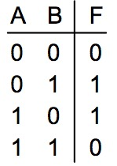

# perceptron

> 다수의 신호를 입력으로 받아 하나의 신호를 출력

 

## XOR

XOR 도 hypothesis로 만들 수 있을까?

하나만으론 안된다. 그래서 세개로 표현했더니 가능 !

실제로 4개의 데이터로 layer1만으로 10000번 돌리면 accuracy : 50% 였던게 layer2를 합쳤을 때 accyracy : 100% 나온다

 

* truth table

그것이 바로 neural network. layer1의 두 개를 합쳐서 하나로 표현해도 무방

 

여기선 W와 b를 직접 초기화 하였는데, 실제로 이 값은 학습을 통해 갱신되어야 한다.

갱신 과정에서 미분이 필요한데 그 방법이 복잡하다. 그리고 그 문제를 back propagation으로 해결한다.