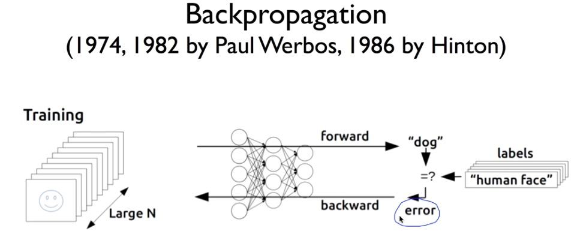
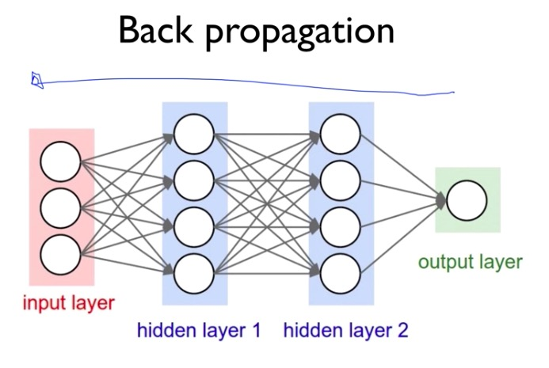
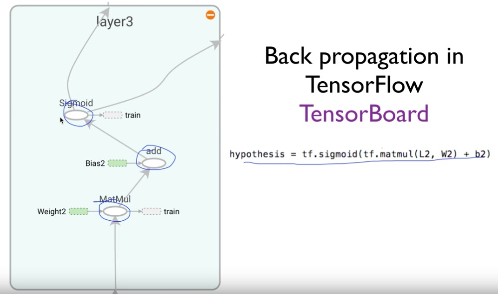

# XOR & back propagation

## XOR

> XOR 도 hypothesis로 만들 수 있을까?

* neural network

## backpropagation

> 예측값과 실제값의 차이(cost, error)를 통해 뒤에서 부터 앞으로 추적하여  조정해야 되는 값(weight, bias)을 계산하겠다

* chain rule

  chain rule 적용해서 df/dw(w가 f에 얼마나 큰 영향을 미치는지), df/dx, df/db 등등 전부 구할 수 있다 !

  따라서 실제값과 예측값의 error를 기반으로 그 값을 변경 가능하다 ...!

  

* exmaple - sigmoid

tensorflow에서는 미분을 통해 back propoagation을 적용하기 위해 그래프 형태로 만들어 놓았다

