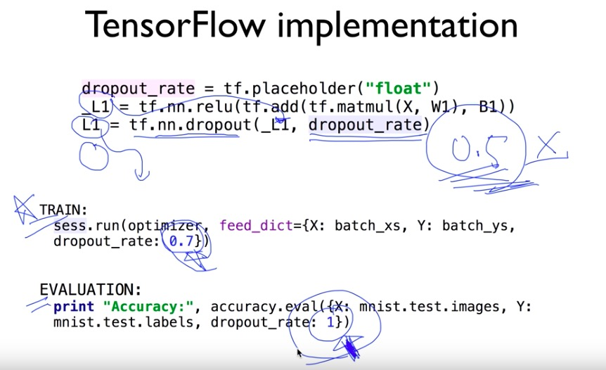

# application & tips


## optimizer

> optimizer마다 장단점이 있기 때문에 모델 마다 다른 optimizer를 사용한다. 대개 SGD와 adam을 많이 사용한다


### SGD (stochastic gradient descent)

SGD는 기울기가 하강하는 방향으로 이동하여 매개변수를 갱신하는 방법. 단순하고 구현하는 방법도 쉽지만, 비등방성(anisotropy) 함수(방향에 따라 기울기가 달라지는 함수)에서는 탐색 경로가 비효율적. 또한 어떤 함수에 대해서는 지그재그로 탐색하는 경우도 있음


### momentum

어떤 함수에 대해 SGD보다 덜 지그재그로 탐색함


### adaGrad

매개변수를 갱신할 때마다 학습률을 조정(더 작게)한다. 매개변수의 원소 중에서 많이 움직인 원소는 학습률이 낮아진다는 뜻인데, 다시 말해 학습률 감소가 매개변수의 원소마다 다르게 적용된다는 것. 지그재그 효과 줄일 수 있음


### adam

momentum과 adaGrad의 융합 방법. 편향 보정이 진행된다. 

### 


## learning rate

한 번의 학습으로 얼마만큼 학습해야 할지, 즉 매개변수 값을 얼마나 갱신해야하느냐를 정하는 것

굉장히 중요. 대개 0.01 정도로 시작

* learning rate가 클 경우 -> overshooting. gradinent decent 알고리즘 적용할 경우 기울기가 적은 지점을 계속해서 찾는데 그 과정 중 아예 범주 밖으로 나가 이상한 결과 값이 나올 수 있다


* learning rate이 작을 경우 -> 결과의 변화가 너무 미세하게 나타난다. local minimum에 빠질 수 있다


따라서 learnig rate의 초기 값을 0.01(대개)로 두고, 그 결과를 관찰하면서 learning rate을 조절한다


## ReLU

> recitified linear unit


### sigmoid의 문제점, vanishing gradient

hidden layer가 많은 상황에서 sigmoid를  사용하게 되면, 뒤의 미분값과 0~1(sigmoid의 결과, actiovation function)의 값이 계속해서 곱해지기 때문에 가장 앞부분 layer로 도달할 수록 input은 최종 output에 미미한 영향을 주게 된다

하지만  가장 가지막단은 0~1 사이로 출력을 해야하기 때문에 sigmoid를 사용한다


- layer는 input layer(input가 연결되어 있는), hidden layer(중간), output layer(output가 연결되어 있는)로 구분한다


### solution

0보다 큰 값에 한해서는 그 값의 영향을 남겨두자는 취지로 ReLU function 도입


## weight(가중치) 초기화

가중치의 초기값을 작게 만들고 싶다고 0으로 설정한다면?

안된다. 정확히는 0보다 가중치를 균일한 값으로 설정하게 되면 back propagation에서 모든 가중치의 값이 똑같이 갱신되기 때문


### RBM

Restricted Boatman Machine, weight의 초기값을 잘 주는 방법으로 Deep Belief Network에 쓰임

기존의 방법은 W(weight)에 랜덤 값을 주어서, 모델을 학습시켰다. 하지만 W값을 초기에 얼마나 잘 주느냐에 따라 학습 속도가 달라지기 때문에 좋은 초기값을 정해주는 것은 중요하다


두개의 인접한 layer에만 초점을 맞춘다. x값을 통해 어떤 결과 값이 나온다면 backword 방향으로 그 결과 값을 이용해 기존의 x와 가장 유사한 값이 나올 수 있도록 weight를 설정한다.

이와 같은 방법으로 모든 인접한 레이어 사이의 weight를 결정한다

하지만 RBM을 구해 적용하는 것 자체에 어려움이 따른다…따라서 보다 간단한 Xaivier initialization이나 He's initialization을 사용한다. 초기화 방법에는 다양한 방법들이 있지만 data에 따라 최적의 방법이 다르다. 아직 연구중인 단계


### Xavier/He initialization

- Xavier

  앞층의 node가 n개라면 표준편차가 1/루트n 인 분포를 사용한다

  activation function이 좌우 대칭일 경우(sigmoid, tanh)에 xavier 사용


- He

  앞층의 node가 n개라면 표준편차가 2/루트n인 분포를 사용한다

  activation function이 ReLU일 때 He 사용


## epoch, batch


**epoch**

전체 data set을 한 번 학습 시키는 것


**batch**

하나로 묶인 입력 데이터. 한번에 학습하면 메모리 할당 많으니까(시간도 많이 걸림) 묶어서 학습하도록 한다. 이 때의 단위가 batch. 이미지 1장당 처리 시간을 대폭 줄여준다

1. 수치 계산 라이브러리 대부분이 큰 배열을 효율적으로 처리할 수 있도록 고도로 최적화 되어 있기 때문
2. 커다란 신경망에서는 데이터 전송이 병목으로 작용하는 경우가 자주 있는데, batch 처리를 함으로써 버스에 주는 부하를 줄인다(느린 I/O를 통해 데이터를 읽는 횟수가 줄어, 빠른 CPU나 GPU로 순수 계산을 수행하는 비율이 높아진다)


ex: 1000개의 데이터가 있을 때 batch 사이즈가 500이면 1epoch을 돌기 위해선 2batch가 필요하다


mini-batch : 데이터가 너무 많을 경우 훈련 데이터에서 일부만 골라 학습. 예를 들어 60000개의 데이터 중 100개만 무작위로 뽑아 훈련한다. 정확하진 않지만 실제 값과 비슷


## preprocessing


실제 데이터는 한쪽으로 치우쳐 있거나, 산발적으로 흩어져 있는 경우가 많다. 이럴 때 zero-centered 또는 normalized하게 data를 preprocessing해야 한다. 그렇지 않은 경우 결과 값이 NaN이나 inf로 나오는 경우 있다


**normalization기법**

nomalization(정규화) : 데이터를 특정 범위로 변환하는 처리

mini batch 입력 데이터를 평균 0, 분산 1인 데이터로 변환한다


* 장점
  - 학습을 빨리 진행할 수 있다
  - 초기값에 크게 의존하지 않는다
  - 오버피팅을 억제한다


* standardization

  nomalization과 비슷한 개념


* min-max scale

  nomalization과 비슷한 개념


```python
from sklearn.preprocessing import MinMaxScaler

xy = MinMaxScaler().fit_transform(xy)
```


## overfitting

학습 데이터를 기억해버려서 새로운 test data 판단을 잘 하지 못한다

수집된 데이터에 정확한 결과를 위해 modeling을 과하게 한것. 아래 graph에서 model2는 일반화되어 있지 않고, 특정 data에 한해 적용할 수 있기 때문에 한계가 있다. machine learning에서 가장 큰 문제가 되고 있다. overfitting은 layer가 많을수록 weight가 많거나(매개변수가 많고 표현력이 높은 모델) 훈련 데이터가 적은 경우 발생한다


해결 방법은 traing data를 많이 갖고 있거나, regurlarization


regularization은 weight 벡터의 제곱의 합을 regurlarization strength만큼 곱해 더하는 방법이다. regurlaization을 쓰지 않는다면 regurlarization strength 값을 작게 하고, 중요하게 생각한다면 크게 한다


### Regularization (일반화)


tensorflow에서 사용법

```python
l2reg = 0.001 * tf.reduce_sum(tf.square(W))
```


## drop out

모델이 깊어지는 경우 overfitting일어나기도 한다. 이 때,

overfitting을 막기 위해선 regularization을 하는데, 신경망 모델이 복잡해지면 가중치 감소만으로는 대응하기 어려운 경우가 있다. 이럴 때 흔히 drop out이라는 방법을 사용한다

이는 훈련층에서 기존의 몇 개의 노드를 임의로 없애버리고 training하겠다는 것. training할 때마다 임의로 선정한 몇 개의 노드를 무시한채로 training하고, 마지막 평가할 때는 모든 노드를 포함한다(훈련 때 삭제한 비율을 )


- 주의

  train : dropout_rate = 0.7(대개 0.5)

  evaluate : dropout_rate = 1 !!!

  tensorflow 1.0 이후 부터 dropout_reate 대신 keep_prob으로 설정해준다. 얼만큼 노드를 살릴것인지

  





## ensemble

> 몇 개의 모델을 통해 학습 시킨 후 나온 예측값을 조합해 예측하는 방법. 평가율이 2% ~ 5%까지 올라간다. 앙상블 학습은 드롭아웃과 밀접하다. 드롭아웃은 앙상블 학습과 같은 효과를 (대략) 하나의 네트워크로 구현했다고 생각할 수 있다


## training & test data set


data set을 training과 test(대개 20~30%)로 나눈다. training은 model이 학습하는데 필요한 용도이고, test는 말 그대로 training된 모델을 평가하기 위함. 


training data set중 일부를 validation data set으로 구분하기도 한다. 이는 learning rate이나 regulaization strength와 같은 하이퍼파라미터의 적절한 값을 찾기 위함


- 훈련 데이터(training) : 매개변수 학습
- 검증 데이터(validation) : 하이퍼파라미터 성능 평가
- 시험 데이터(testing) : 신경망의 범용 성능 평가


**0단계**

하이퍼파라미터 값의 범위를 설정한다

**1단계**

설정된 범위에서 하이퍼파라미터의 값을 무작위로 추출한다

**2단계**

1단계에서 샘플링한 하이퍼파라미터 값을 사용하여 학습하고, 검증 데이터로 정확도를 평가한다(단, 에폭은 작게 설정)

**3단계**

1단계와 2단계를 특정 횟수(100회 등) 반복하며, 그 정확도의 결과를 보고 하이퍼파라미터의 범위를 좁힌다


이는 과학이라보다 직관에 의존하는 방법이다. 좀 더 세련된 방법으로는 **Bayesian optimization(베이즈 최적화)**가 있다


## Online learning


online learning이란 기존의 data로 학습된 model에 새로운 data를 추가로 학습시키는 것을 말한다


## 꿀팁 summary


## 오버피팅 정리


* 경우

  training 데이터가 부족할 때

  feature개수가 많을 때

* 해결 방법

  training 데이터 많이

  feature 개수 감소

  normalization

  regularization

  drop out

  esemble