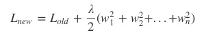

# application & tips

 

</br>

## learning rate

한 번의 학습으로 얼마만큼 학습해야 할지, 즉 매개변수 값을 얼마나 갱신해야하느냐를 정하는 것

굉장히 중요. 대개 0.01 정도로 시작

</br>

* learning rate가 클 경우 -> overshooting. gradinent decent 알고리즘 적용할 경우 기울기가 적은 지점을 계속해서 찾는데 그 과정 중 아예 범주 밖으로 나가 이상한 결과 값이 나올 수 있다


</br>

* learning rate이 작을 경우 -> 결과의 변화가 너무 미세하게 나타난다. local minimum에 빠질 수 있다


따라서 learnig rate의 초기 값을 0.01(대개)로 두고, 그 결과를 관찰하면서 learning rate을 조절한다


</br>

## preprocessing


실제 데이터는 한쪽으로 치우쳐 있거나, 산발적으로 흩어져 있는 경우가 많다. 이럴 때 zero-centered 또는 normalized하게 data를 preprocessing해야 한다. 그렇지 않은 경우 결과 gradient descent 결과 NaN이나 inf로 나오는 경우 있다(그래프를 벗어났기 때문)


</br>

**normalization기법**

nomalization(정규화) : 데이터를 특정 범위로 변환하는 처리

</br>

* standardization

  normalization 형태


</br>

* min-max scale

  nomalization과 비슷한 개념

  <//br>


```python
from sklearn.preprocessing import MinMaxScaler

xy = MinMaxScaler().fit_transform(xy)
```


</br>

## overfitting

학습 데이터에만 과적합되어 있어 새로운 test data 판단을 잘 하지 못한다

수집된 데이터에 정확한 결과를 위해 modeling을 과하게 한것. 아래 graph에서 model2는 일반화되어 있지 않고, 특정 data에 한해 적용할 수 있기 때문에 한계가 있다. machine learning에서 가장 큰 문제가 되고 있다. overfitting은 대개 특정 weight가 큰 값을 갖거나, 훈련 데이터가 적은 경우 발생한다


### Solutions

</br>


</br>

### Regularization

>가중치가 클 수록 패널티를 적용해 가중치를 감소(weight decay)시키는 방법으로 overfitting을 줄이는 효과 있다

</br>

* L2 reg : 기존 cost function에 모든 weight의 제곱을 더한 식을 새로운 cost function으로 사용. 람다(regularization strength)는 패널티의 세기를 결정하는 하이퍼파라미터로, 그 값이 클 수록 가중치에 제약을 준다. 이 방법이 패널티를 주는 이유는 weight값이 갱신 될 때 "w = w - w에 대한 미분(cost function)" 으로 이루어지기 때문에 cost function이 커지는 것은 곧 w을 더 작게 보정하는 효과가 있는 것이다

</br>



</br>

```python
l2reg = 0.001 * tf.reduce_sum(tf.square(W))
```


* L1 reg : 기존 cost function에 모든 weight의 절대값을 더한 식을 새로운 cost function으로 사용

</br>


</br>

## overfitting 정리


- 경우

  training 데이터가 부족할 때

  특정 weight가 큰 값을 가질 때

  feature개수가 많을 때(machine learning에서)

  layer가 많을 때

  </br>

- 해결 방법

  training 데이터 많이

  feature 개수 감소(machine learning에서)

  batch normalization

  regularization - regularization, drop out(nn에서만), esemble


</br>


## training & test data set


data set을 training과 test(대개 20~30%)로 나눈다. training은 model이 학습하는데 필요한 용도이고, test는 말 그대로 training된 모델을 평가하기 위함. 


training data set중 일부를 validation data set으로 구분하기도 한다. 이는 learning rate이나 regulaization strength와 같은 하이퍼파라미터의 적절한 값을 찾기 위함

</br>

- 훈련 데이터(training) : 매개변수 학습
- 검증 데이터(validation) : 하이퍼파라미터 성능 평가
- 시험 데이터(testing) : 신경망의 범용 성능 평가

</br>

**0단계**

하이퍼파라미터 값의 범위를 설정한다

**1단계**

설정된 범위에서 하이퍼파라미터의 값을 무작위로 추출한다

**2단계**

1단계에서 샘플링한 하이퍼파라미터 값을 사용하여 학습하고, 검증 데이터로 정확도를 평가한다(단, 에폭은 작게 설정)

**3단계**

1단계와 2단계를 특정 횟수(100회 등) 반복하며, 그 정확도의 결과를 보고 하이퍼파라미터의 범위를 좁힌다


이는 과학이라보다 직관에 의존하는 방법이다. 좀 더 세련된 방법으로는 **Bayesian optimization(베이즈 최적화)**가 있다


</br>

## Online learning


online learning이란 기존의 data로 학습된 model에 새로운 data를 추가로 학습시키는 것을 말한다

</br>


## epoch, batch


</br>

**epoch**

전체 data set을 한 번 학습 시키는 것

</br>

**batch**

하나로 묶인 입력 데이터. 한번에 학습하면 메모리 할당 많으니까(시간도 많이 걸림) 묶어서 학습하도록 한다. 이 때의 단위가 batch. 이미지 1장당 처리 시간을 대폭 줄여준다

1. 수치 계산 라이브러리 대부분이 큰 배열을 효율적으로 처리할 수 있도록 고도로 최적화 되어 있기 때문
2. 커다란 신경망에서는 데이터 전송이 병목으로 작용하는 경우가 자주 있는데, batch 처리를 함으로써 버스에 주는 부하를 줄인다(느린 I/O를 통해 데이터를 읽는 횟수가 줄어, 빠른 CPU나 GPU로 순수 계산을 수행하는 비율이 높아진다)


</br>

ex: 1000개의 데이터가 있을 때 batch 사이즈가 500이면 1epoch을 돌기 위해선 2batch가 필요하다


mini-batch : 데이터가 너무 많을 경우 훈련 데이터에서 일부만 골라 학습. 예를 들어 60000개의 데이터 중 100개만 무작위로 뽑아 훈련한다. 정확하진 않지만 실제 값과 비슷


