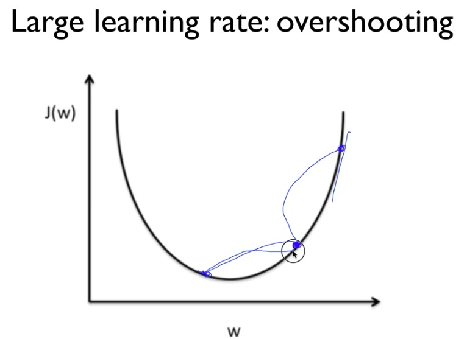
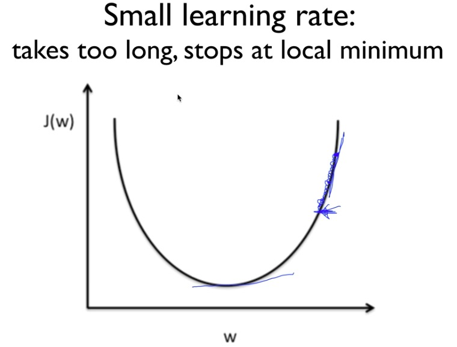
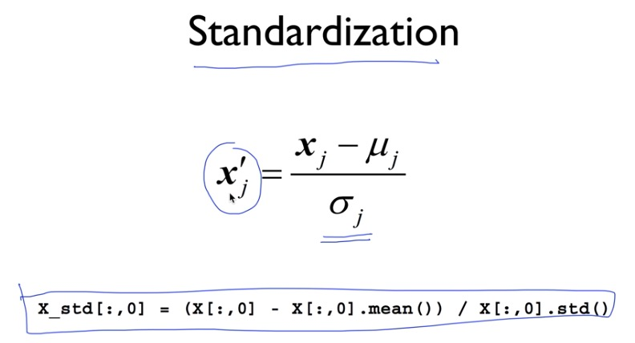
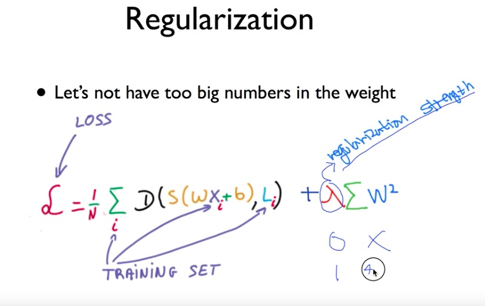
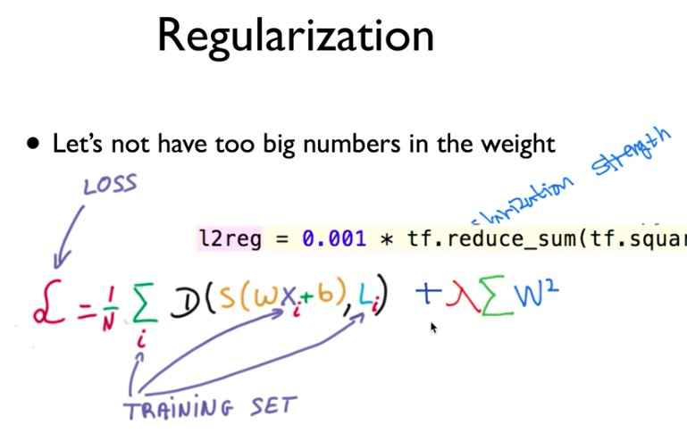
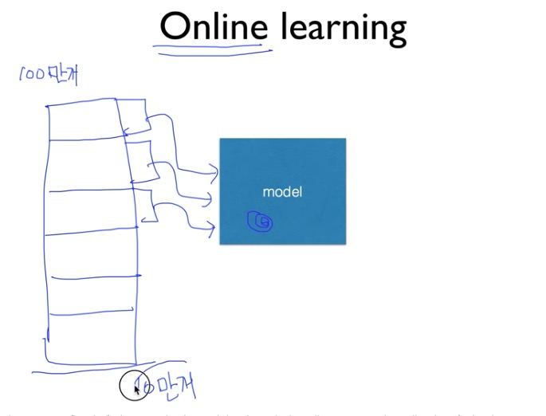

# application & tips


## learning rate

한 번의 학습으로 얼마만큼 학습해야 할지, 즉 매개변수 값을 얼마나 갱신해야하느냐를 정하는 것

굉장히 중요. 대개 0.01 정도로 시작

* learning rate가 클 경우 -> overshooting. gradinent decent 알고리즘 적용할 경우 기울기가 적은 지점을 계속해서 찾는데 그 과정 중 아예 범주 밖으로 나가 이상한 결과 값이 나올 수 있다




* learning rate이 작을 경우 -> 결과의 변화가 너무 미세하게 나타난다. local minimum에 빠질 수 있다





따라서 learnig rate의 초기 값을 0.01(대개)로 두고, 그 결과를 관찰하면서 learning rate을 조절한다


## preprocessing


실제 데이터는 한쪽으로 치우쳐 있거나, 산발적으로 흩어져 있는 경우가 많다. 이럴 때 zero-centered 또는 normalized하게 data를 preprocessing해야 한다


**normaliztion기법**

정규화 : 데이터를 특정 범위로 변환하는 처리

전처리 : 입력 데이터에 특정 변환을 가하는 것

* standardization




* min-max scale


```python
from sklearn.preprocessing import MinMaxScaler

xy = MinMaxScaler().fit_transform(xy)
```


## overfitting

수집된 데이터에 정확한 결과를 위해 modeling을 과하게 한것. 아래 graph에서 model2는 일반화되어 있지 않고, 특정 data에 한해 적용할 수 있기 때문에 한계가 있다. machine learning에서 가장 큰 문제가 되고 있다. layer가 많을수록 weight가 많아지면서 overfitting되는 경우가 많다


해결 방법은 traing data를 많이 갖고 있거나, regurlarization


regularization은 weight 벡터의 제곱의 합을 regurlarization strength만큼 곱해 더하는 방법이다. regurlaization을 쓰지 않는다면 regurlarization strength 값을 작게 하고, 중요하게 생각한다면 크게 한다





tensorflow에서 사용법

```python
l2reg = 0.001 * tf.reduce_sum(tf.square(W))
```


## training & test data set


data set을 training과 test(대개 30%)로 나눈다. training은 model이 학습하는데 필요한 용도이고, test는 말 그대로 training된 모델을 평가하기 위함


training data set중 일부를 validation data set으로 구분하기도 한다. 이는 learning rate이나 regulaization strength를 결정할 때 사용




online learning이란 기존의 data로 학습된 model에 새로운 data를 추가로 학습시키는 것을 말한다





## epoch, batch


**epoch**

전체 data set을 한 번 학습 시키는 것


**batch**

하나로 묶인 입력 데이터. 한번에 학습하면 메모리 할당 많으니까(시간도 많이 걸림) 묶어서 학습하도록 한다. 이 때의 단위가 batch. 이미지 1장당 처리 시간을 대폭 줄여준다

1. 수치 계산 라이브러리 대부분이 큰 배열을 효율적으로 처리할 수 있도록 고도로 최적화 되어 있기 때문
2. 커다란 신경망에서는 데이터 전송이 병목으로 작용하는 경우가 자주 있는데, batch 처리를 함으로써 버스에 주는 부하를 줄인다(느린 I/O를 통해 데이터를 읽는 횟수가 줄어, 빠른 CPU나 GPU로 순수 계산을 수행하는 비율이 높아진다)


ex: 1000개의 데이터가 있을 때 batch 사이즈가 500이면 1epoch을 돌기 위해선 2batch가 필요하다


mini-batch : 데이터가 너무 많을 경우 훈련 데이터에서 일부만 골라 학습. 예를 들어 60000개의 데이터 중 100개만 무작위로 뽑아 훈련한다. 정확하진 않지만 실제 값과 비슷