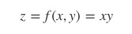
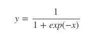

# back propagation

> 예측값과 실제값의 차이(cost, error)를 통해 뒤에서 부터 앞으로 추적하여 조정해야 되는 값(weight, bias)의 기울기를 계산하겠다


* chain rule

  합성 함수의 미분은 합성 함수를 구성하는 각 함수의 미분의 곱으로 나타낼 수 있다

  chain rule 적용해서 df/dw(w가 f에 얼마나 큰 영향을 미치는지), df/dx, df/db 등등 전부 구할 수 있다

  따라서 실제값과 예측값의 error를 기반으로 구하고자 하는 값들을 변경한다


### 덧셈 node

- 덧셈 노드의 수식

  

  

- 덧셈 노드의 로컬 그래디언트

  

  

- 덧셈 노드의 계산그래프. 현재 입력값에 대한 Loss의 변화량은 로컬 그래디언트에 흘러들어온 그래디언트를 각각 곱한다. 덧셈 노드의 역전파는 흘러들어온 그래디언트를 그대로 흘려보내는 걸 확인할 수 있다


### 곱셈 node

- 곱셈 노드의 수식

  

  

- 곱셈 노드의 로컬 그래디언트

  

  

- 곱셈 노드의 계산그래프. 현재 입력값에 대한 Loss의 변화량은 로컬 그래디언트에 흘러들어온 그래디언트를 각각 곱한다. 곱셈 노드의 역전파는 순전파 때 입력 신호들을 서로 바꾼 값을 곱해서 하류로 흘려보내는 걸 확인할 수 있다


### Sigmoid node

- **시그모이드(sigmoid)** 함수

  

  

- 시그모이드 노드의 로컬 그래디언트

  

- 계산그래프


### ReLU Node

* **활성화함수(activation function)**로 사용되는 **ReLU**는 수식

  

* ReLU 노드의 로컬 그래디언트

  

* 계산그래프


### affine

행렬의 곱


* 수식

  

  

* 로컬 그래디언트


* 계산그래프

  


* 배치용 affine(X가 N개 묶여 있을 경우)


### softmax - with - loss node

뉴럴네트워크 말단에 보통 **Softmax-with-Loss** 노드를 둡니다. Softmax-with-Loss란 소프트맥스 함수와 **교차 엔트로피(Cross-Entropy)** 오차를 조합한 노드를 뜻한다. 소프트맥스 함수와 교차 엔트로피의 수식은 아래와 같다

*ak = 노드의 입력값, L=노드의 출력값(Loss), tk=정답 레이블(0 혹은 1), n=정답 범주 개수*


* 계산 그래프


Softmax-with-Loss 노드는 a를 입력으로 받아서 Loss L을 출력한다. 역전파하는 그래디언트는 yk − tk가 된다. 예컨대 정답이 t3이라면 역전파되는 그래디언트는 각각 y1 ,y2, y3−1이 된다.

요컨대 Softmax-with-Loss 노드의 역전파 그래디언트를 구하려면 입력값에 소프트맥스 확률값을 취한 뒤, 정답 레이블에 해당하는 요소만 1을 빼주면 된다는 의미


```python
import numpy as np
p = np.exp(a) / np.sum(np.exp(a)) # softmax 확률 계산
da = np.copy(p)
da[target] -= 1 # target=정답 인덱스를 갖고 있는 변수
```


tensorflow에서는 미분을 통해 back propoagation을 적용하기 위해 그래프 형태로 만들어 놓았다


