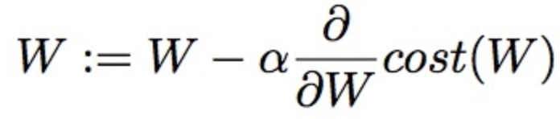
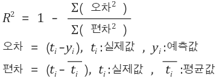

# Check list

</br>

### 활성화 함수 종류 및 사용 이유

활성화 함수 : sigmoid, tanh, relu, leaky relu, elu, selu, prelu, maxout, softmax

**선형 층을 깊게 쌓아도 여전히 하나의 선형 연산이기 때문에**(결국 하나의 Layer로 표현 가능) XOR같은 비선형 문제를 풀 수 없어 층을 여러 개로 구성하는 장점이 없음. 따라서 **(비선형 시스템을 만들어)가설 공간을 풍부하게 만들기 위해** **비선형성을 갖는 활성화 함수**를 추가(Keras, p.110)

</br>

</br>

### 오차역전파(역전파, Backpropagation)

활성화 함수를 적용한 MLP로 XOR 문제를 해결하였지만, layer가 깊어질 수록, parameter가 너무 많고 parameter를 갱신 하는 것에 어려움 발생. 이 때 오차역전법과 Gradient Descent 활용되는데, 오차역전법은 결국 **출력층의 error를 입력층으로 전달하면서 출력에 대한 입력의 기울기(weights)를 구하는 과정이다.** 기울기 계산 시 chain rule 이용.

</br>

</br>

### 경사 하강법(Gradient Descent)

오차역전파로 깊고, 복잡한 신경망에서 기울기를 구하는 것은 많은 계산 필요로 하기 때문에 효율적인 방식 필요. 오차역전파 알고리즘으로 각 layer에서 기울기 값을 구하고 그 기울기 값을 이용하여 Gradient descent 방법으로 가중치w와 b를 update시키는 방식.

**매개변수 갱신 식**



</br>

</br>

### 손실 함수 종류

* MSE(Mean Squared Error)

* RMSE

* MAE

* CEE(Cross Entropy Error)

정확도를 놔두고 '손실 함수'라는 우회적인 방법을 택하는 이유는 딥러닝은 **오차역전파법**(역전파, back propagation) 방식을 활용해 오차를 줄여 나가는데 이 때 미분을 사용하기 때문이다. 하지만 정확도 or AUC 등은 미분 불가능하기 때문에 매개변수의 미소 변화가 있어도 반응이 없거나 불연속적으로 변화한다. 따라서 '손실 함수'라는 우회적인 방법을 이용하는 것이며, 궁극적으로 손실 함수가 최소가 되는 최적의 매개 변수 값을 찾는다.(계단 함수를 활성화 함수로 사용하지 않는 이유와도 동일하다.)

</br>

</br>

### 평가 지표(metric) 종류

**결정 계수(R^2)**



**Accuracy, 정확도**

(TP + TN) / (TP + TN + FP + FN)

전체 중에서 얼마나 맞췄는지

</br>

**Precision, 정밀도(양성 예측도)**

(TP) / (TP + FP)

True라고 예측한 것 중 진짜 True는 얼마나 있는지

거짓 양성의 수(FP)를 줄이는 것이 목표일 때 사용한다

거짓 양성 없다 = 정밀도 1

</br>

**TPR(참 양성 비율), Recall(재현율), Sensitivity(민감도)**

(TP) / (TP + FN)

진짜 양성 중 양성이라고 맞춘 비율(높을 수록 좋다)

모든 양성 샘플을 식별해야 할 때 사용한다. 즉 거짓 음성(FN)을 피하는 것이 중요한 경우로서 암 진단 사례가 하나의 예이다

**재현율 최적화**와 **정밀도 최적화**는 서로 상충한다(trade off 관계)

거짓 음성 없다 = 재현율 1

</br>

**TNR, Specificity, 특이도**

(TN) / (TN + FP)

 = 1 - fall out

</br>

**FPR(허위 양성 비율), Fall out**

진짜 음성 중 양성이라고 잘못 예측한 경우의 비율(낮을 수록 좋다)

(FP) / (FP + TN)

</br>

**f1 score**

2 * (정밀도 * 재현율) / (정밀도 + 재현율)

정밀도와 재현율의 조화 평균이다

정밀도 재현율 f-점수를 한번에 확인하는 방법으로 classification_report가 있다

</br>

**평균 정밀도**

정밀도-재현율 곡선의 아랫부분 면적을 계산한다(0 ~ 1)

</br>

**AUC**

ROC 곡선의 아랫부분 면적을 계산한다(0 ~ 1). 불균형한 데이터셋에서는 정확도보다 AUC가 훨씬 좋은 지표이다. 우선 여러 모델을 비교해 AUC가 높은 모델을 찾고, 임계값을 조정한다

</br>

* 클래스 분포가 균일한 분류 문제 : ROC AUC
* 클래스 분포가 균일하지 않은 분류 문제 : 정밀도, 재현율
* 랭킹(ordinal regression) 및 다중 레이블 문제 : 평균 정밀도(정밀도-재현율 곡선의 아랫부분 면적)

</br>

</br>

### batch_size, epoch, iterations

train data의 개수가 20,000개. batch_size가 500이라고 가정하면 1epoch을 돌기 위해 40회 학습 필요하다. 그리고 30 epoch을 돌기 원한다면 30 * 40회 학습을 해야한다.

</br>

</br>

### Gradient Vainishing

nn의 학습 방식(weight의 갱신 방식)은 backpropagation으로 이루어지는데, 이 때 gradient(변화량, 기울기)값이 점차 줄어들어 학습을 방해하는 현상을 의미한다. backpropagation식에서 cost function의 gradient 항(activation 함수의 미분 값)이 존재하는데, 이 값이 0에 가까워지는 것이다. 이는 활성화 함수를 sigmoid나 tanh를 사용할 경우 도함수의 결과 값이 각각 0~0.25, 0~1이기 때문에 신경망이 깊어질 수록 weight의 영향력이 소실되어 제대로 갱신되지 않고, 학습이 어려워진다. 이를 막기위해 Relu, Leaky Relu, Maxout, Elu 등의 활성화 함수를 사용한다. Relu의 경우 도함수가 0 또는 1더 좋은 해결책은 LSTM, GRU를 사용하는 것이다. 이유는 **이해안되니 나중에 다시 공부하자.**

보통 DNN에서 cost function은 MSE 또는 cross entropy를 사용하는데, cross entropy의 경우 weight, bias 업데이트 식에서 gradient 항(activation 함수의 미분 값)이 없어지기 때문에 gradient vanishing 문제에서 좀 더 자유롭다(레이어가 한 개 일때는 완벽하게 없어짐. 즉, 최초의 레이어는 gradient항이 없음). 하지만 레이어가 여러 개이면 결국 gradient가 곱해지므로 완전히 자유로울 수는 없다.

</br>

</br>

### Gradient Exploding

그래디언트 소실과는 반대로 역전파에서 그래디언트가 점점 커져 입력층으로 갈수록 가중치 매개변수가 기하급수적으로 커지게 되는 경우가 있는데 이를 **그래디언트 폭주**(exploding gradient)라고 하며, 이 경우에는 발산(diverse)하게되어 학습이 제대로 이루어지지 않는다. weight 초기값이 크게 설정될 경우 발생 가능하다

</br>

</br>

### Xavier/He initialization

가중치를 균일한 값으로 설정하게 되면 back propagation에서 모든 가중치의 값이 똑같이 갱신된다. 따라서 각 층의 활성화값들을 광범위하게 분포시킬 목적으로 가중치의 적절한 분포를 찾고자 한다. 왜냐하면 각 층의 다수의 뉴런이 출력하는 값이 한 쪽에 집중되어 있다면 표현력 관점에서 큰 문제가 있기 때문이다. 이는 뉴런을 하나만 두는 것과 다를 바가 없다 

Gradient Vanishing/Exploding 현상을 완화하기 위해 출력 값을 표준 정규 분포를 갖게 하는 초기화 방법을 활용한다


- Xavier

  표준 정규 분포를 입력 개수의 표준편차로 나눠준다

  ```python
  w = np.random.randn(n_input, n_output) / sqrt(n_input)
  ```

  activation function이 좌우 대칭일 경우(sigmoid, tanh)에 xavier 사용한다

  

- He

  표준 정규 분포를 (입력 개수/2)의 표준편차로 나눠준다

  ```python
  w = np.random.randn(n_input, n_output) / sqrt(n_input/2)
  ```

  activation function이 ReLU일 때 He 사용한다

</br>

</br>

### 머신러닝의 근본적인 이슈

좋은 머신러닝을 설계하는 것은 최적화와 일반화 사이의 줄다리기이며, 진짜 문제는 일반화이다. 드롭아웃 등을 사용해 **과대적합을 줄이는 기본 단계를 거친 후 과대적합이 일어날 때 까지 네트워크의 용량을 늘리는 것**이 좋다(용량을 늘리는 방법은 층을 추가하고, 층의 크기를 키우고, 더 많은 epoch동안 훈련하는 것이다). 이후 **규제, 하이퍼파라미터 튜닝, Feature Engineering**을 시작하여 과소적합도 아니고, 과대적합도 아닌 이상적인 모델에 가깝도록 만든다.

</br>

</br>

### Overfitting 피하는 방법

1. 많은 훈련 데이터를 활용해 모델 학습한다

2. 모델의 capacity를 줄인다(단순화 한다)

3. 가중치 규제

   *규제 : 적은 수의 패턴만 기억하게 만들어서 가장 중요한 패턴에 집중*

   * **Ridge 회귀(L2 규제)** : 선형 회귀에 L2규제를 추가한 회귀 모델. cost function에 회귀 계수의 제곱의 합을 추가한다. 회귀 계수가 큰 경우 더 큰 penalty를 받게 한다. 다중공선성을 방지한다. 1만개의 변수가 있다면 계속 1만개의 변수가 남는다. alpha값이 커질 수록 회귀 계수(W)의 크기는 지속적으로 작아진다. **가중치 감쇠**라고도 한다
   * **Lasso 회귀(L1 규제)** : 선형 회귀에 L1규제를 추가한 회귀 모델. cost function에 회귀 계수의 절대값의 합을 추가한다. 변수들끼리 correlation 관계가 있다면 하나의 항만 남고, 전부 사라지게 된다. L2 규제가 회귀 계수 값의 크기가 커지는 것을 방지하는 데 반해, L1규제는 예측 영향력이 작은 피처의 회귀 계수를 0으로 만들어 회귀 예측 시 **피처가 선택되지 않게 한다(가중치 0으로 만듬)**. 정보가 손실 될 우려가 있다. alpha값이 커질 수록, 회귀 계수의 크기가 0인 피처가 많아진다
   * ElasticNet : L1, L2 규제를 함께 사용하는 것을 의미한다. 주로 피쳐가 많은 데이터에 활용되며, 수행 시간이 상대적으로 오래 걸린다

   **위의 가중치 규제는 모두 테스트가 아닌 훈련시에만 추가된다**

4. Drop out : NN에서 기존의 몇 개의 노드를 무작위로 제외하고 훈련한다. 이 때 제외시킬 노드의 비율을 정할 수 있으며 보통 0.2 ~ 0.5 사이로 지정한다.  테스트 단계에서는 모든 노드를 포함한다. 핵심 아이디어는 층의 출력 값에 노이즈를 추가하여 중요하지 않은 우연한 패턴을 깨트리는 것이다

5. Batch Normalization

6. Outlier를 없앤다 -> 특정 Outlier에 과적합 되는 모델을 피하기 위해 학습 시, 아예 outlier를 제외 시킴.

</br>

</br>

### Normalization

데이터는 작은 값(대부분 0~1)을 취하며, 균일해야 한다(scaling). 그렇지 않으면, **업데이트할 그래디언트가 커져 네트워크가 수렴하는 것을 방해**하기 때문이다

**Batch Normalization**

각 층의 활성화값 분포가 적당히 퍼져야 학습이 원할하게 수행되는데, 이를 '강제'하는 방법으로 mini batch 입력 데이터를 평균 0, 분산 1인 데이터로 변환한다. 여기서 입력 데이터는 활성화 함수 직전의 Wx를 의미한다. x는 동일 값이니, 결과적으로 W(weight)에 대한 정규화이며, 일반적인 data normalization과는 원리는 같지만 대상이 다르다는 차이가 있다. 활성화 함수 전에 적용한다.

- 학습을 빨리 진행할 수 있다
- 초기값에 크게 의존하지 않는다(weight 초기값 선택에 크게 영향 안받을 수 있음)
- 오버피팅을 억제한다(drop out 필요성 감소)
- gradient vanishing 문제 해결

https://wikidocs.net/61375

https://89douner.tistory.com/44

</br>

</br>

### Ensemble

* Voting : 보통 서로 다른 유형의 모델 활용.
  * Soft : class 확률을 평균하여 결정(분류). 일반적으로 soft voting이 hard voting 보다 성능 좋아 자주 활용됨.
  * Hard : 모델 간 다수결로 최종 class 결정(분류)
* Bagging : 모두 동일 유형의 모델이지만, 데이터 샘플링을 서로 다르게 가져감(Bootstrapping). 이 때, 데이터 중복 가능. 단일 모델은 Decision Tree 모델이 주로 활용됨. ex) Random Forest 
* Boosting : 모두 동일 유형의 모델이지만, 앞에서 학습한 모델 예측의 에러가 높은 데이터에 대해 가중치를 부여해 다음 모델이 학습하는 방식. 과적합 가능성 높음. 단일 모델로는 Decision Tree 모델이 주로 활용됨.ex) XGboost, Catboost, LGBM
* Stacking : 서로 다른 유형의 모델 활용해 얻은 결과 값을 다시 학습 데이터로 만들어서 또 다른 모델(meta model)로 재학습 시켜 최종 결과 예측.


### 최적화(optimizer) 종류


### PCA - 차원 축소

### KNN

### CNN

### RNN(LSTM, GRU)

https://dgkim5360.tistory.com/entry/understanding-long-short-term-memory-lstm-kr

### Decision Tree

### SVM

### Baysiean

### 추천 시스템

### AutoEncoder