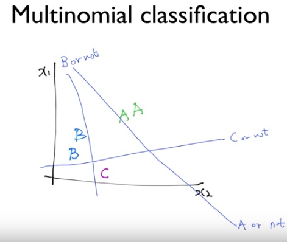

# classification

> classification을 logisitic(binary)과 mutinomial 두 가지로 구분하여 분석했다. 

## Logistic classification(logistic regression)

### example(binary classifiacation)

spam detection : spam or ham

facebook feed : show or hide

credit card fraudulent transaction detection : legitimate or fraud

### description

classification에서는 출력값이 0과 1 사이로 나와야 한다

linear regression만으론 정의역의 값이 너무 크거나 작은 경우 그 결과 값이 크게 벗어날 수 있다(결과는 오직 0과 1뿐이기 때문)

따라서 아래의 sigmoid 함수를 이용하며, 이는 어떤 정의역에 대해서도 0 ~1사이의 결과 값을 갖는다

sigmoid 함수를 식으로 나타내면 아래와 같다

하지만 위의 H(X)로 cost function을 만들면 각 위치마다 최소가 되는 지점을 찾기가 어렵다. 왜냐면 기울기가 0이 되는 것을 통해 최소 지점을 찾는데, 기울기가 0이 되는 곳이 여러 곳에 위치하기 때문. 아래 참조

따라서 이를 해결하기 위해 cosf function을 기존의 linear regression(mean squared error, 평균 제곱 오차)에서와는 다르게 만들어야 한다

이와 같이 적용할 수 있는 이유는 y값이 1일 때와 0일 때(binary기 때문에 y값은 두 가지 밖에 없다) 아래의 그래프처럼 나오기 때문이다

y(실제값)이 1일 때, H(X)는 1에 가까워 질 수록 cost function(둘의 차이)는 0으로 수렴한다. H(X)는 0에 가까워 질 수록 cost function(둘의 차이)는 무한히 커진다

반대로 y(실제값)이 0일 때, H(X)는 0에 가까워 질 수록 cost function은 무한히 커지고, 1에 가까워 질 수록 0으로 가까워진다

실제로 두 그래프를 붙여보면 기존의 linear regression에서 cost function 그래프(밥그릇 모양)과 비슷하다는 것을 확인할 수 있다

따라서 cost function을 정리하면 위와 같다. y의 값에 따라 나누는 것이 불편하기 때문에 가장 아래처럼 한번에 적용

### 정리

binary classification(logistic classification)은 0~1사이의 출력값을 얻기 위해 활성화 함수를 sigmoid로 사용하는데, 이 때 cost function은 기존의 mean squared error로는 구할 수 없다. 따라서 위와 같이 구한다

## Softmax Regression(Multinomial Logistic Regression)

세 가지로 분류할 경우

logistic classification을 세 가지로 나누어 보는 것

#### hypothesis

활성화 함수로 softmax function 사용한다

각각의 scrore를 결국 A, B, C 각 확률로 나타내야 한다. 여기서 세 가지 확률은 각각 0~1 사이여야 하고, 그 확률의 총 합은 1이다. softmax function에 대한 자세한 내용은 neural network에서 상세하게 표기해두었다

#### one hot encoding

**'one-hot' encoding**을 통해 가장 확률이 높은 a 당첨

### cost function

cost function으로 **cross entropy error(CEE, 교차 엔트로피 오차)** 사용한다

사실 logistic cost function과 cross entropy는 일치 한다고 볼 수 있다. 그 이유는

logistic 에서는 y값이 0 또는 1 이있는데, 이를 one-hot encoding 벡터로 바꿔서 cross entropy를 적용해 보면 

0=>[1, 0], 1=>[0, 1] 이다

logistic 을 풀자면, 

-log(H(x))   : y = 1 => [0, 1] 

-log(1-H(x)) : y = 0 => [1, 0] 

cross entropy 를 풀자면,

sigma(Li * -log(Si))

y = L, H(x) = S 이므로 

L:[0, 1], S:H(x) 

=> sigma([0, 1] ( * ) -log[0, 1]) = 0 

L:[1, 0], S:1-H(x) 

=> sigma([1, 0] ( * ) -log[1-0, 1-1]) = sigma([1,0] ( * ) -log[1,0]) = 0 

이 대입으로 보면 logistic cost & cross entropy 는 같은 의미이다

따라서 전체 cost function은 아래와 같다

