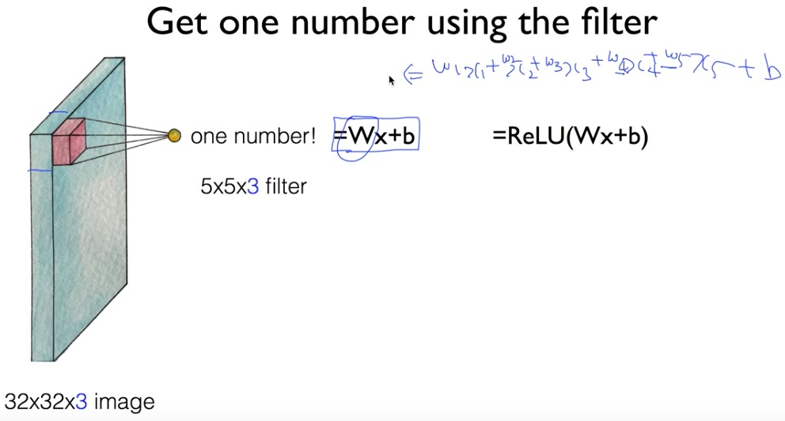
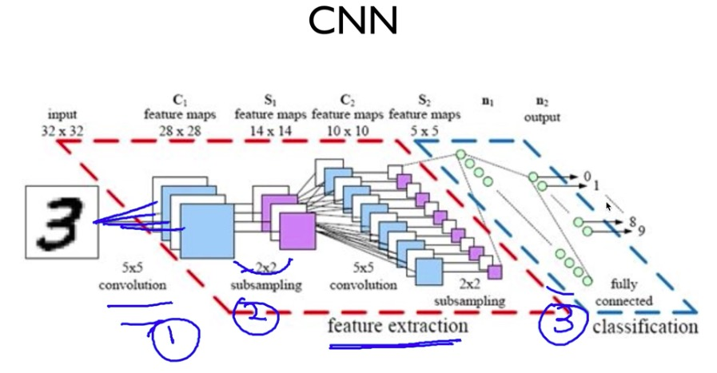

# convolutional network

> 고양이 실험. 고양이가 한 이미지를 바라볼 때, 전체 이미지 중 특정 부분에만 반응하는 neuron존재. 따라서 일정 크기의 필터(커널)를 이용해 각 부분을 뽑아보자라는 아이디어에서 출발

32는 image의 사이즈를 의미하고, 3은 색상(RGB)정보를 의미한다

* stride : 몇 칸씩 진행시킬 것인지
* problem : filter를 적용한 ouput size가 점점 줄어든다 -> 정보가 줄어드는 것

#### padding을 넣는 효과

output image가 기존의 7x7 그대로 유지된다(stride가 1일 때). 정보를 그대로 유지할 수 있음

모서리 부분을 network가 확인할 수 있게함

커널을 이용해 전체 이미지를 convolution 연산한 결과(특정 특징이 잘 나타난 이미지) 맵

6개의 filter를 통해 나온 convolution layer는 activation maps라고 가르킨다. 여기서 padding을 적용하지 않았다면 activation maps의 크기는 (32 - 5)/1 + 1 = 28, filter의 개수 6을 통해 28 x 28 x 6이 된다

첫번째에서 convolutional layer에서 weight의 개수는 6 x 5 x 5 x 3 = 450

두번째에서 convolutional layer에서 weight의 개수는 10 x 5 x 5 x 6 = 1500

## pooling

>  추출된 Activation map을 인위로 줄이는 작업, sub sampling

.

풀링 레이어가 하는 일은 네트워크의 파라미터의 개수나 연산량을 줄이기 위해 representation의 spatial한 사이즈를 줄이는 것이다. 이는 오버피팅을 조절하는 효과도 가지고 있다

max pooling이 자주 쓰인다

conv, relu, pool의 순서 및 횟수는 특별히 정해진 것 없다

1단계 : convolution

2단계 : feature extraction(sub sampling, convolution...)

3단계 : (fully connected layer를 통한) classification

## study case

imageNet 대회, ResNet, 3%대, fast foward 사용

google(deep mind), alpago