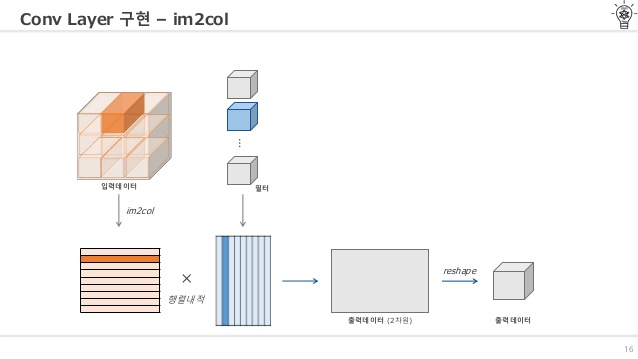

# convolutional neural network

> fc(fully connected)는 데이터의 형상이 무시된다는 문제점이 있다. cnn 전까지는 mnist 데이터와 같은 경우 1차원 데이터로 평탄화 과정 거쳤다. 하지만 이미지는 3차원 형상이며 그 형상안에는 유의미한 공간적 정보가 담겨 있다

## fc VS cnn

아래 그림과 같이 ConV layer와 pooling layer 추가된다. pooling layer는 생략되기도 한다

fc와 다르게 3차원 데이터같이 입체적인 데이터가 흐른다(?)

## cnn

고양이 실험. 고양이가 한 이미지를 바라볼 때, 전체 이미지 중 특정 부분에만 반응하는 neuron존재. 따라서 일정 크기의 filter(커널)를 이용해 각 부분을 뽑아보자라는 아이디어에서 출발

32는 image의 사이즈를 의미하고, 3은 색상(RGB)정보를 의미한다(3차원 형상)

### 합성곱 연산(filter 연산)

filter의 매개변수가 fc에서의 weight(가중치)에 해당한다.

### padding

데이터 주변을 특정 값으로 채우기도 한다. 패딩을 키우면 출력 크기는 커진다

주로 출력 크기를 조정할 목적으로 사용한다. 심층 신경망에서는 합성곱 연산을 몇 번씩 되풀이 하기 때문에 연산을 거칠 때마다 크기가 작아지면 더이상 연산을 적용할 수 없게 되기 때문

모서리 부분을 network가 확인할 수 있게함

### stride

필터가 이동하는 간격. 스트라이드를 키우면 출력 크기는 작아진다

#### 입력 크기 (H,W),필터크기(FH,FW),패딩(P), 스트라이드(S)에 따른 출력크기(OH,OW)계산

OH, OW는 정수로 나와야 한다. (반올림 하는 경우도 있음)

### 3차원 데이터 합성곱 연산

이 때, 입력 데이터의 채널 수와 필터의 채널 수가 같아야 한다. 여기선 3개. 또한 필터 자체의 크기는 원하는 값으로 설정할 수 있지만 모든 채널의 필터 크기가 같아야 한다

블록(Channel, Height, Weight) 관점에서 입력 데이터가 필터를 거친 후 한 장의 activation map(특정 특징이 잘 나타난 이미지)이 되었다. 다른 말로 하면 channel이 1개인 activation map. 그럼 다수의 channel을 ouput으로 하기 위해선?

-> 다수의 filter를 사용한다

따라서 filter의 weight 데이터는 4차원(출력 채널 수(필터의 개수), 입력 채널 수, 높이, 너비). 이 값을 전부 곱한 값이 conv layer의 weight개수

이후에 출력 데이터와 편향(FN, 1, 1)을 더하는데, 서로 다른 형상을 더할 때 numpy의 broadcast 기능을 사용한다

위 그림은 입력 데이터를 한 덩어리로 묶어 **batch 처리**한 것. 선두에 배치용 차원을 추가했다. 여기서 주의할 점으로는 신경망에 4차원 데이터가 하나 흐르 때마다 데이터 N개에 대한 합성곱 연산이 이뤄진다는 것이다. 즉, N회분의 처리를 한번에 수행하는 것이다

#### example

6개의 filter를 통해 나온 convolution layer는 activation maps라고 가르킨다. 여기서 padding을 적용하지 않았다면 activation maps의 크기는 (32 - 5)/1 + 1 = 28, filter의 개수 6을 통해 28 x 28 x 6이 된다(filter의 channel은 3, 개수는 6)

## pooling

>  추출된 Activation map을 인위로 줄이는 작업, sub sampling

pooling의 window 크기와 stride는 같은 값으로 설정하는 것이 보통

풀링 레이어가 하는 일은 네트워크의 파라미터의 개수나 연산량을 줄이기 위해 representation의 spatial한 사이즈를 줄이는 것이다. 이는 작은 데이터셋에 한해서 오버피팅을 방지하는 효과도 가지고 있다

Striving for Simplicity : The All Convolutional Net 이라는 논문에서는 pooling을 하지 않고 convolutional layer만 이용하는 방법이 제안되고 있으며, 최근 추세는 pooling을 사용하지 않는 쪽으로 발전하고 있다고 언급되어 있다

max pooling(영역에서 가장 큰 원소 하나를 꺼내는 것)이 자주 쓰인다

conv, relu, pool의 순서 및 횟수는 특별히 정해진 것 없다

### pooling의 특징

* 학습해야 할 매개변수가 없다

* channel 수가 변하지 않는다

* 입력의 변화에 영향을 적게 받는다

### conv layer 구현 - im2col로 데이터 구현하기

im2col : image to column

4차원 입력데이터를 im2col 함수를 사용해 2차원으로(reshape) 필터링하기 좋게 전개한다. 필터도 reshape을 사용해 2차원으로 전개한다. 둘의 행렬을 곱한 결과는 2차원의 출력데이터이다. cnn은 데이터를 4차원 배열로 저장하므로 2차원인 출력 데이터를 다시 4차원으로 변형(reshape)한다

im2col 함수 적용한 경우, batch size오 무관하게 원소 개수는 필터의 원소수와 마찬가지로 channel x height x width 이다

그런데 conv layer 사용하는 이유가 유의미한 공간 정보를 담기 위해서인데, 이렇게 im2col을 사용해도 되면 그 정보가 조금은 소실되지 않을까?

### pooling layer 구현

### 층 깊이에 따른 추출 정보 변화

convolutional layer를 여러 겹 쌓으면, 층이 깊어지면서 더 복잡하고 추상화된 정보가 추출된다. 예를 들어 처음 층은 단순한 에지에 반응하고, 이어서 텍스처에 반응하고, 더 복잡한 사물의 일부에 반응하고록 변화한다. 즉, 층이 깊어지면서 뉴런이 반응하는 대상이 단순한 모양에서 '고급' 정보로 변화해간다. 이는 사물의 '의미'를 이해하도록 변화하는 것

1단계 : convolution

2단계 : feature extraction(sub sampling, convolution...)

3단계 : (fully connected layer를 통한) classification

## study case

LeNet, AlexNet

imageNet 대회, ResNet, 3%대, fast foward 사용

google(deep mind), alpago