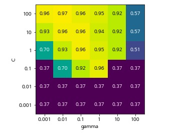
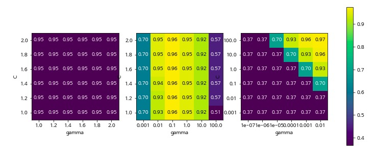
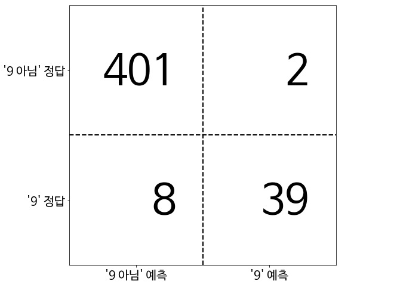
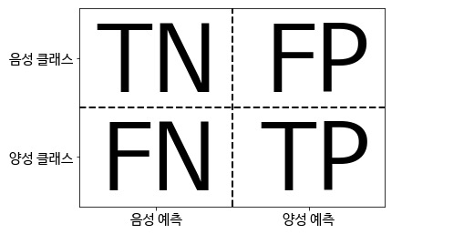

> 이 기록은 "파이썬 라이브러리를 이용한 머신러닝" 내용을 정리하였고, 여기에  "파이썬 머신러닝 완벽 가이드" 내용 및 인터넷 자료가 추가되었다

</br>

### 매니폴드 학습

다차원의 정보로부터 바르고 곧은 유클리디안 공간을 찾아내는 것을 말합니다. 그럼으로써 주어진 정보를 더 컴팩트하면서도 의미있고 효과적인 형태로 표현할 수 있도록 해줍니다. (수집된 데이터 사이의 거리가 가까운 경우 유클리디안 거리 허용 가능)

</br>

# Models

> 각 model의 특징을 이해하고, dataSet에 따라 적합한 model을 찾는 것이 목표

</br>

새로운 dataSet으로 작업할 때는 linear model이나 naibe bayes 또는 knn과 같은 간단한 model로 시작해서 성능이 얼마나 나오는지 가늠해보는 것이 좋다. data를 충분히 이해한 뒤에 random forest나 gradient boosting decision tree, SVM, nn같은 복잡한 model을 고려한다

</br>

</br>

## K-NN(K Nearest Neighbors)

regression : KNeighborsRegressor()

classification : KNeighborsClassifier()

</br>

### 주요 매개변수

weight : uniform, distance

n_neighbors : 이웃 수

</br>

### 장점

이해하기 쉽다

</br>

### 단점

dataSet의 shape(sampe, feature)이 너무 큰 경우 잘 작동하지 않고 느리다

전처리 과정 중요하다

sparse dataSet의 경우 잘 안맞는다

</br>

</br>

## Linear model

regression의 경우, 보통 Ridge()를 선호하지만 특성이 많고, 그 중 일부 feature만 중요하다면 Lasso()

다항 회귀도 선형 회귀이다. 회귀에서 선형/비선형 회귀를 나누는 기준은 회귀 계수가 선형/비선형인지에 따른 것이지 독립변수의 선형/비선형 여부와는 무관하다

범주형 변수가 정수로 표기되어 있는 경우 연속형 변수로 해석한다. 따라서 이 경우 one-hot-encodig을 사용한다

구간 분할이나 다항식과 상호작용 특성을 새로 추가해 큰 이득을 볼 수 있다

</br>

경사하강법 : W(new) = W - learning rate * 미분(cost(W)) 방식으로 W 갱신

피쳐가 N개 있다면 그에 따른 회귀 계수도 N + 1(하나는 w0, 절편)개로 도출됨

확률적 경사하강법 : 전체 X, y 데이터에서 랜덤하게 batch_size만큼 데이터를 추출해 W 갱신

</br>

cost function : **RSS(W)** + alpha * **W**)

목표 : cost function의 최소화. Min(**RSS(W)** + alpha * **W**)

RSS(W) : bias를 낮추기 위함

W : variance를 낮추기 위함. (Ridge에서는 W의 제곱, Lasso에서는 W의 절대값)

</br>

선형 회귀의 경우 숫자형 카테고리 값을 사용할 때, 숫자형 값에 크게 영향을 받는 경우가 발생할 수 있다. 따라서 선형 회귀에서는 이러한 피처 인코딩에 one-hot-encoding을 적용한다

</br>

### Ridge 회귀(L2 회귀)

선형 회귀에 L2규제를 추가한 회귀 모델. cost function에 회귀 계수의 제곱의 합을 추가해 penalty항을 만들어 회귀 계수가 큰 경우 더 큰 penalty를 받게 한다. 다중공선성을 방지한다. 1만개의 변수가 있다면 계속 1만개의 변수가 남는다

**주요 파라미터**

alpha값이 커질 수록, 회귀 계수(W)의 크기는 지속적으로 작아진다

</br>

### Lasso 회귀(L1 회귀)

선형 회귀에 L1규제를 추가한 회귀 모델. cost function에 회귀 계수의 절대값의 합을 추가한다. 변수들끼리 correlation 관계가 있다면 하나의 항만 남고, 전부 사라지게 된다. L2 규제가 회귀 계수 값의 크기가 커지는 것을 방지하는 데 반해, L1규제는 예측 영향력이 작은 피처의 회귀 계수를 0으로 만들어 회귀 예측 시 **피처가 선택되지 않게 한다(가중치 0으로 만듬)**. 정보가 손실 될 우려가 있다

**주요 파라미터**

alpha값이 커질 수록, 회귀 계수의 크기가 0인 피처가 많아진다

<https://godongyoung.github.io/%EB%A8%B8%EC%8B%A0%EB%9F%AC%EB%8B%9D/2018/02/07/ISL-Linear-Model-Selection-and-Regularization_ch6.html>


</br>

### ElasticNet

Ridge와 Lasso의 결합. L1, L2 매개변수 정해줘야한다. 주로 피처가 많은 데이터 셋에 사용된다

수행 시간이 상대적으로 오래 걸린다

**주요 파라미터**

alpha :  a + b (a : L1 규제, b : L2 규제)

l1_ratio : a / (a + b)

</br>

### Logistic Regression

선형 회귀 방식을 기반으로 하되 시그모이드 함수를 이용해 분류를 수행하는 회귀

가볍고 빠르며 예측 성능도 뛰어나기 때문에 기본 모델로 사용하는 경우 많다

**주요 파라미터**

penalty(default=l2) : l1 or l2

C : 1/alpha, C 값이 작을 수록 규제 강도 높다

</br>

regression : linearRegression(), Ridge()(L2), Lasso()(L1), ElasticNet(), SGDRegressor()(dataSet 대용량 일 때)

classification : LogisticRegression(), LinearSVC(), SGDClassifier()(dataSet 대용량 일 때)

</br>

### 주요 매개변수

alpha(regression) :  regularization 강도. 클 수록 regularization 크다, model 단순하다

C(classification) : regularization 강도. 클 수록 regularization 적다, model 단순하다

solver(regression) : "sag", 더 빠르게 학습한다

</br>

### 데이터셋

feature와 target이 종 모양의 정규분포를 이룰 수록 좋다. 특히 target

### 장점

첫 번째로 시도할 알고리즘

학습속도 및 예측 빠르다

훈련과정 이해하기 쉽다

대용량 dataSet에서 잘 작동한다

고차원 data에서도 잘 작동한다(특히 sample보다 feature 개수가 더 많은 경우는 완벽하게 예측)

sparse dataSet에서 잘 작동한다

</br>

### 단점

저차원의 dataSet에서는 **다른 model의 일반화 성능이 더 좋다**

</br>

</br>

## Naive Bayes Classifier

분류만 있다

GaussianNB()는 대부분 고차원 dataSet

MNB()는 보통 0이 아닌 feature가 비교적 많은 dataSet에서 BNB()보다 성능이 좋다

classification : GaussianNB()(연속적인 data), BernoulliNB()(이진 data), MultinomialNB()(카운트 data)

</br>

### 주요 매개변수

alpha : regularization 강도. 클 수록 regularization 크다, model 단순하다

</br>

### 장점

훈련과 예측 속도 빠르다

훈련 과정 이해하기 쉽다

linear model보다 훨씬 빠르다 덜 정확하다

대용량 dataSet 가능하다

고차원 dataSet 가능하다

희소한 고차원 dataSet에서 잘 작동한다

비교적 매개변수에 민감하지 않다

</br>

### 단점

linear model보다 덜 정확하다(일반화 성능 조금 뒤진다)

</br>

</br>

### Decision Tree

균일도(정보이득, 지니계수)가 높은 데이터 세트를 먼저 선택할 수 있도록 규칙 조건을 찾아 자식 트리 노드에 걸쳐 반복적으로 분할한 뒤, 데이터가 모두 나뉘게 되면 분류를 멈춘다

Decision Tree를 학습한다는 것은 정답에 가장 빨리 도달하는 yes or no의 질문 목록(test)을 학습하는 것

완전한 tree : 모든 leaf node가 순수 node인 tree(train dataSet 100% 정확도. overfitting)

tree model은 feature의 순서에도 영향을 받는다

tree model은 훈련 세트에 있는 특성의 범위 밖으로 외삽(extrapolation)할 능력이 없다. 이런 경우 테스트 세트와 가장 가까이 있는 마지막 훈련 세트 데이터의 타깃값을 예측으로 사용한다(예를 들어 시계열 data처럼 훈련 세트는 yy/mm/dd까지의 data이고, 테스트 세트는 그 이후의 경우)

</br>

regression : DecisionTreeRegressor()(최종 영역의 타깃값의 평균값을 예측 결과로 한다)

classifiacaton : DecisionTreeClassifier()(최종 영역의 타깃값 중 다수인 것을 예측 결과로 한다)

</br>

### 주요 매개변수

max_depth : 최대 연속된 질문 목록(test). default는 무한정 깊어질 수 있음(max_depth, max_leaf_nodes, min_samples_leaf 중 하나만 지정해도 overfitting을 막는데 충분하다)

max_features : 최적의 분할을 위해 고려할 최대 feature 개수. default는 none으로 모든 feature 사용

min_samples_leaf : leaf node가 되기 위한 최소한의 sample개수. 불균형 데이터의경우 특정 클래스의 데이터가 극도로 작을 수 있으므로 이 경우는 작게 설정 필요

min_samples_split : 매개변수를 사용해 node가 분기할 수 있는 최소 sample 개수

</br>

### 장점

매우 빠르다

시각화 수월하다

data scaling에 구애받지 않는다. 정규화나 표준화 같은 전처리 과정 필요없다

</br>

### 단점

overfitting 가능성 다분하다 -> Decision Tree Ensemble

</br>

</br>

## Ensemble

> 전통적으로 voting, bagging, boosting 으로 나눌 수 있으며, 이외에도 stacking을 포함한 다양한 앙상블 방법이 있다. Voting은 일반적으로 여러 모델을 사용하고, bagging과 boosting은 동일 모델을 사용한다. bagging은 데이터를 boostsrap aggregating 방식으로 취합해 각 모델간 독립적이며, boosting은 잘못 예측한 데이터에 가중치를 부여해 학습하며, 모델(weak-learner)은 서로 연속적이라고 할 수 있다

* Voting : 서로 다른 알고리즘 사용
* * hard :  다수결
  * soft : 레이블 값 결정 확률을 모두 더하고 이를 평규냏서 이들 중 확률이 가장 높은 레이블 값을 최종 보팅 결과값으로 선정. 일반적으로 소프트 보팅이 보팅 방법으로 적용됨
* Bagging : 모두 같은 유형의 알고리즘 사용하고, 데이터 샘플링(Booststrapping)을 다르게 가져가면서 학습. RandomForest
* Boosting :  앞에서 학습한 모델이 예측이 틀린 데이터에 대해 올바르게 예측할 수 있도록 다음 모델에게는 가중치를 부여하면서 학습. XGboost, LightGBM. Catboost
* Stacking : 여러 가지 다른 모델의 예측 결괏값을 다시 학습 데이터로 만들어서 다른 모델(메타 모델)로 재학습시켜서 결과를 예측하는 방법

</br>

## Random Forest(Decision Tree Ensemble)

같은 알고리즘으로 여러 개의 모델을 만들어서 보팅으로 최종 결정하는 알고리즘

잘 작동하되 서로 다른 방향으로 overfit된 tree를 많이 만들어 그 결과의 평균을 사용해 overfitting줄인다. tree를 만들 땐 random하게 많이 만든다. 

Decision Tree는 각 node에서 전체 특성을 대상으로 최선의 test를 찾지만, Random Forest는 알고리즘이 각 node에서 후보 feature를 무작위로 선택한 후(max_features로 제한) 이 후보들 중에서 최선의 test를 찾는다

tree를 만들기 위해 먼저 data의 bootstrap sample을 생성한다. 즉 n_samples개의 data 포인트 중에서 무작위로 data를 n_samples 횟수만큼 반복 추출한다(**중복 가능**)

***(Booststrapping : 여러 개의 데이터 세트를 중첩되게 분리하는 것. Bagging은 Booststrap aggregating의 줄임말***

서브세트의 데이터 건수는 전체 데이터 건수와 동일하지만, 개별 데이터가 중첩되어 만들어진다

bootstrap sampling은 tree가 조금씩 다른 dataSet을 이용해 만들어지도록 하고, tree의 각 분기는 다른 feature 부분 집합을 사용해 모든 tree가 서로 달라지도록 돕는다

</br>

regression : RandomForestRegressor()

classifier : RandomForestClassifier()

</br>

### 주요 매개변수

n_estimators : 생성할 tree의 개수. 이 값이 크면 tree들은 서로 매우 비슷해지고, 낮추면 서로 많이 달라지며 깊이가 깊어진다. 클 수록 좋다

n_jobs : 사용할 core 개수(-1 모든 core, default값은 1)

max_features : feature 개수 제한. 작을 수록 overfitting 줄어든다. 기본값을 사용하는 것이 좋다(regressiong의 경우 max_features = n_features, classification의 경우 max_features = sqrt(n_features). decision tree나 gradient boosting tree의 경우 기본값 "None")

* hyperparameter tuning

https://medium.com/all-things-ai/in-depth-parameter-tuning-for-random-forest-d67bb7e920d

</br>

### 장점

decision tree보다 거의 항상 좋은 성능을 낸다

hyperparameter tuning을 많이 하지 않아도 된다

data scaling에 구애받지 않는다. 정규화나 표준화 같은 전처리 과정 필요없다

매우 큰 dataSet에서도 잘 작동한다

</br>

### 단점

의사 결정 과정을 간소하게 표현할 경우 Decision Tree가 더 낫다

고차원 희소 dataSet에서 잘 작동하지 **않는다**

linear model보다 많은 메모리를 사용하며 훈련과 예측이 보다 느리다

hyper parameter가 너무 많고 그로 인해 튜닝 시간이 오래 걸린다

</br>

</br>

## Gradient Boosting Tree(Decision Tree Ensemble)

여러 개의 약한 학습기를 순차적으로 학습-예측하면서 잘못 예측한 데이터에 가중치 부여를 통해 오류를 개선해 나가는 학습 방식

AdaBoost와의 차이는 가중치 업데이트를 경사 하강법을 이용한다는 것

이전에 만든 tree의 예측과 타깃값 사이의 오차를 줄이는 방향으로 새로운 tree를 추가하는 알고리즘. 이를 위해 손실 함수를 정의하고 경사 하강법을 사용해 다음에 추가될 tree가 예측해야 할 값을 보정해나간다

랜덤포레스트와 달리 무작위성이 없다. 대신 강력한 사전 가지치기가 사용된다. 보통 하나에서 다섯 정도의 깊지 않은 tree를 사용하므로 메모리를 적게 사용하고 예측도 빠르다. 이런 얕은 tree같은 간단한 model(weak learner)을 많이 연결하는 것이 근본 아이디어이며, tree는 많을 수록 좋다

</br>

regression : GradientBoostingRegressor()

classification : GradientBoostingClassifier() 

</br>

### 주요 매개변수

n_estimator : 트리 개수. n_estimator의 크기 커지면 model 복잡해지기 때문에 정확도는 높아질 수 있지만 overfitting될 가능성 있다

learning_rate : 이전 tree의 오차를 얼마나 강하게 보정할 것인지 제어. 낮추면 비슷한 복잡도의 모델을 만들기 위해서 더 많은 tree를 추가한다. 따라서 n_estimator와 연관성이 크다

일반적으로 시간과 메모리 한도내에서 n_estimator를 맞추고, 적절한 learning_rate찾는다

max_depth : 일반적으로 작게 설정하며, tree의 깊이가 **5**보다 깊어지지 않게 한다

</br>

### 장점

random forest보다 성능이 좋다

random forest보다 메모리를 적게 사용하고 예측도 빠르다 

data scaling에 구애받지 않는다. 정규화나 표준화 같은 전처리 과정 필요없다

</br>

### 단점

random forest보다 hyperparameter tuning에 좀 더 민감하다

random forest보다 학습시간은 더 길다

희소한 고차원 데이터에는 잘 작동하지 않는다

</br>

</br>

## XGboost(eXtra Gradient Boost)

GBM에 기반을 하고 있다. 하지만, GBM의 단점인 느린 수행 시간 및 과적합 규제(Regrularization) 부재 등의 문제를 해결하며, 특히 병렬 CPU 환경에서 병렬 학습이 가능해 빠르게 학습 가능하다. 파이썬 래퍼 XGboost와 사이킷런 래퍼 XGboost 두 가지가 있다. 사이킷런 래퍼 모듈은 사이킷런의 다른 estimator와 사용법이 같은 데 반해 파이썬 래퍼는 고유의 API와 하이퍼 파라미터를 사용한다. 여기선 사이킷런 래퍼 모듈을 기본으로 설명

</br>

파라미터의 경우 titanic code도 함께 보면 도움됨

</br>

**sklearn API**

```python
from xgboost import XGBClassifier
# import xgboost as xgb

model = XGBClassifier()
# model = xgb.XGBClassifier()
```

**python API**

```python
import xgboost as xgb

# regressor인지 classification인지 따로 구분 안해도 된다?
model = xgb
```

</br>

### 주요 일반 파라미터

nthread : CPU의 실행 스레드 개수. 디폴트는 CPU의 전체 스레드를 다 사용하는 것

</br>

### 주요 부스터 파라미터

> bold체는 과적합 막기 위한 parameter

**learning_rate**(default=0.1) : learning rate. 보통 0.01 ~ 0.02 값을 사용한다

num_boost_rounds : 트리의 개수(GBM의 n_estimators와 같은 파라미터)

**min_child_weight**(default=1) : GBM의 min_child_leaf와 유사. 과적합을 조절하기 위해 사용

**gamma**(default=0) : 트리의 리프 노드를 추가적으로 나눌지를 결정할 최소 손실 감소 값. 해당 값보다 큰 손실이 감소된 경우에 리프 노드를 분리한다. 값이 클수록 과적합 감소 효과가 있다

**max_depth**(default=6) : 0으로 지정하면 깊이 제한 없음. 보통 3~10 값을 적용

**subsample**(default=1) : 데이터를 샘플링하는 비율. 보통 0.5 ~ 1 적용

**colsample_bytree**(default=1) : 트리 생성에 필요한 feature를 임의로 샘플링 하는 데 사용. 매우 많은 feature가 있는 경우 과적합을 조정하는 데 적용

**reg_lambda**(default=1) : L2 regularization 적용 값. feature 개수가 많을 경우 적용을 검토하며 값이 클수록 과적합 감소 효과

**reg_alpha**(default=0) : L1 regularization 적용 값. feature 개수가 많을 경우 적용을 검토하며 값이 클수록 과적합 감소 효과

scale_pos_weight(default=1) : 불균형 데이터 셋의 균형을 유지하기 위함

</br>

### Learning Task 파라미터

objective : 최솟값을 가져야할 손실 함수를 정의한다. XGboost는 많은 유형의 손실 함수를 사용할 수 있다. 주로 사용되는 손실함수는 이진 분류인지 다중분류인지에 따라 달라진다

binary:logistic : 이진 분류일 때 적용

multi:softmax : 다중 분류일 때 적용. 이 때는 레이블 클래스의 개수인 num_class를 적용해야 한다

eval_metric : 검증에 사용되는 함수. 기본값은 회귀인 경우 rmse, 분류일 경우 error

* rmse : root mean square error
* mae : mean absolute error
* logloss : negative log-likelyhood
* error : binary classification error rate(0.5 threshold)
* merror : multicast classifiaction error rate
* mlogloss : multiclass logloss
* auc : area under the curve

</br>

### 장점

GBM이 갖는 장점

규제 가능하다(GBM은 불가능)

수행 시간 빠르다(CPU 병렬 사용해 GBM보다 빠르다. 뿐만 아니라 early stopping 기능 추가. Random forest보다는 느림)

**early_stopping_rounds 예시**

n_estimators : 400, early_stopping_rounds : 100

400번 반복 수행하지 않고 311번 반복한 후 학습을 완료한다. 이유는 211번 반복 시 logloss가 0.085이고 311번 반복 시 logloss가 0.086인데, 211번에서 311번까지 early_stopping_rounds=100으로 지정된 100번의 반복 동안 성능 평가 지수가 향상되지 않았기 때문. 조기 중단된 경우가 그렇지 않은 경우보다 성능 더 안좋을 수도 있다. 하지만 큰 차이는 아니다

</br>

### 단점

GBM이 갖는 단점

</br>

### Loss graph

evals_result() 내장 함수 이용

https://setscholars.net/wp-content/uploads/2019/02/visualise-XgBoost-model-with-learning-curves-in-Python.html

</br>

## LightGBM

기존의 대부분 트리 기반 알고리즘은 트리의 깊이를 효과적으로 줄이기 위한 **균형 트리 분할(level wise)** 방식을 사용한다. 즉, 최대한 균형 잡힌 트리를 유지하면서 분할하기 때문에 트리의 깊이가 최소화 될 수 있다. 이렇게 균형 잡힌 트리를 생성하는 이유는 오버피팅에 보다 더 강한 구조를 가질 수 있다고 알려져 있기 때문이다. 반대로 균형을 맞추기 위한 시간이 필요하다는 상대적인 단점이 있다. 하지만 LightGBM은 **리프 중심 트리 분할(leaf wise)** 방식은 트리의 균형을 맞추지 않고, 최대 손실 닶을 가지는 리프 노드를 지속적으로 분할하면서 트리의 깊이가 깊어지고 비대칭적인 규칙 트리가 생성된다. 이런 방식은 학습을 반복할수록 결국은 균형 트리 분할 방식보다 예측 오류 손실을 최소화 할 수 있다

</br>

### 주요 파라미터

n_estimators(default=100) : 트리의 개수. 너무 많으면 과적합으로 성능 저하 될 수 있음

learning_rate(default=0.1) : 학습률. 너무 작으며 과적합 이슈와 학습 시간이 길어지는 부정적 영향 발생 가능

**max_depth**(default=-1) : 0보다 작으면 깊이 제한 없다. LightGBM은 leaf wise 기반이므로 싶이가 상대적으로 더 깊다

**min_child_samples**(default=20) : min_samples_leaf와 동일. 리프 노드가 되기 위해 필요한 최소한의 샘플 수

**num_leaves**(default=31) : 하나의 트리가 가질 수 있는 최대 리프 개수

**sub_sample** : 과적합 제어하기 위해 데이터 샘플링하는 비율을 지정

**colsample_bytree**(default=1) : 무작위로 선택하는 feature의 비율로 과적합을 제어

**reg_lambda**(default=0) : L2 regularization. feature개수가 많을 경우 적용 검토하며 값이 클수록 과적합 감소 효과

**reg_alpha**(default=0) : L1 regularization

</br>

### Learning Task 파라미터

objective : XGboost와 동일


</br>

### 장점

XGboost보다 빠른 학습 및 예측 시간

XGboost보다 적은 메모리 사용량

카테고리형 feature의 자동 변환과 최적 분할(one-hot-encoding 사용하지 않고도 카테고리형 feature를 최적으로 변환하고 이에 따른 노드 분할 수행. XGboost는 불가능)

병렬 computing

GPU 지원

</br>

### 단점

일반적으로 10000개 샘플 이하의 데이터셋의 경우 overfitting이 쉽게 발생한다

</br>

## SVM(kernerlized Support Vector Machines)

각 support vector와의 거리를 측정해 margin을 넓히는 방식. support vector의 중요도는 훈련 과정에서 학습한다

</br>

regression : SVR()

classification : SVC()

### 주요 매개변수

gamma : 가우시안 커널 폭의 역수. 훈련 샘플이 미치는 영향의 범위를 결정(분류되는 영역). 작은 값은 넓은 영역을 뜻하며 큰 값이라면 영향이 미치는 범위가 제한적이기 때문에 값이 커지면 model이 그만큼 복잡해짐

C : 각 포인트의 중요도를 제한. 값이 클수록 model이 복잡해짐

</br>

### 장점

feature가 적어도 복잡한 결정 경계를 만들 수 있다

저차원, 고차원 dataSet 모두 잘 작동한다

</br>

### 단점

hyperparameter tuning에 민감하다

data scaling에 민감하다. 특히 입력 feature의 범위가 비슷해야 한다. 따라서 0과 1사이의 값으로 맞추는 방법을 주로 사용한다(MinMaxScaler())

sample이 많을 경우 잘 작동하지 않는다. 시간과 메모리 관점에서도 힘들다

</br>

</br>

## Deep Learning

충분히 overfintting되어 문제를 해결할 수 있는 큰 model을 설계한다. 이후 다음 훈련 data가 충분히 학습될 수 있다고 생각될 때 신경망 구조를 줄이거나 규제 강화를 위해 alpha 값을 증가시켜 일반화 성능을 향상시킨다

매끄러운 결정 경계를 원한다면 hidden layer output을 늘리거나, hidden layer를 늘리거나, tanh 함수를 사용할 수 있다

weight 초기값에 따라 model이 크게 달라질 수 있다

</br>

regression : MLPRegressor(), Dense()

classification : MLPClassifier(), Dense()

</br>

### 주요 매개변수

hidden_layer_sizes : hidden layer의 개수와 각 layer의 output. 보통 입력 feature의 수와 비슷하게 설정. 수천 초중반을 넘는 일은 거의 없다

activation : hidden layer의 활성화 함수

alpha : 클 수록 regularization(L2 페널티) 심하다. 기본값은 매우 낮다

random_state : weight 초기값 설정

max_iter : warning 뜨면 늘려줘야한다. default는 200

solver : 매개변수 학습에 사용하는 알고리즘 지정. default는 adam

</br>

### 장점

대량의 data에 내재된 정보를 잡아내고 매우 복잡한 model을 만들 수 있다

<br>

### 단점

hyperparameter tuning에 민감하다

data scaling 영향 크다. 평균은 0, 분산은 1이 되도록 변형하는 것이 좋다

큰 model은 학습시간이 오래 걸린다

</br>

## 분류 예측의 불확실성 추정

어떤 테스트 포인트에 대해 분류기가 예측한 클래스가 무엇인지 뿐만 아니라 정확한 클래스임을 얼마나 확신하는지가 중요하다. 예측값은 모델에 담긴 많은 정보가 이미 손실된 상태이기 때문에 분류기는 예측의 확신을 가늠하기 위한 decision_function()과 predict_proba() 두 가지가 함수를 제공한다

### 결정 함수

이진 분류에서 decision_function() 반환값의 크기는 (n_samples,) 이며 각 샘플이 하나의 실수 값을 반환한다. 이 값은 모델이 데이터 포인트가 양성 클래스인 클래스 1에 속한다고 믿는 정도이다. 양수 값은 양성 클래스를 의미하며 음수 값은 음석 클래스를 의미한다. 값의 범위는 데이터와 모델 파라미터에 따라 달라진다. 이진 탐색에서 decision_function

다중 분류에서는 결과값의 크기가 (n_samples, n_classes)이다

</br>

### 예측 확률

decision_function

predict_proba()의 출력은 각 클래스에 대한 확률이고, 이진 분류에서 이 값의 크기는 (n_samples, 2)이다. 확률이기 때문에 출력은 항상 0과 1사이의 값이며 두 클래스에 대한 확률의 합은 항상 1이다

다중 분류에서는 결과값의 크기가 (n_samples, n_classes)이다

</br>

### 학습 과정 그리기

https://machinelearningmastery.com/display-deep-learning-model-training-history-in-keras/

</br>

</br>

# 전처리

**StandardScaler()** : 각 feature의 평균을 0, 분산을 1로 변경해 모든 feature가 같은 크기를 가지게 한다

**RobustScaler()** : StandardScaler()와 비슷하지만 평균을 중간값, 분산을 사분위 값을 사용한다. outlier에 영향을 받지 않게 한다

**MinMaxScaler()** : 모든 feature가 정확하게 0과 1 사이에 위치하도록 데이터를 변경한다. X_test의 경우 X_train으로 fit된 scaler를 이용해 transform하기 때문에 0과 1 사이에 위치하지 않을 수 있다

**Normalizer()** : feature 벡터의 유클리디안 길이가 1이 되도록 데이터 포인트를 조정한다. 다른 scaler는 feature의 통계치를 이용하지만 normalizer는 sample마다 각기 정규화 된다

</br>

</br>

# 차원 축소

feature 선택과 feature 추출로 나눌 수 있다.

* feature 선택 : 특정 feature에 종속성이 강한 불필요한 feature는 아예 제거하고, 데이터의 특징을 잘 나타내는 주요 feature만 선택
* feature 추출 : 기존 feature를 저차원의 중요 feature로 압축해서 추출하는 것. 이렇게 새롭게 추출된 중요 feature는 기존의 feature가 압축된 것이므로 기존의 feature와는 완전히 다른 값이 됨(데이터를 잘 설명할 수 있는 잠재적인 요소(Latent Factor)를 추출하는 것이 목표)

</br>

**<u>*특징*</u>**

* 선형 모델에서는 feature가 많을 수록 다중 공선성 문제로 모델의 예측 성능 저하된다
* 학습에 필요한 처리 능력을 줄일 수 있다
* 수백 개 이상의 feature로 구성된 데이터 셋의 경우 상대적으로 적은 차원에서 학습된 모델보다 예측 신뢰도가 떨어진다
* overfitting을 막는 데 도움이 될 수 있다
* 매우 많은 차원을 가지고 있는 이미지나 텍스트에서 차원 축소를 통해 잠재적인 의미를 찾아 주는 데 효과적이다

</br>

## PCA(Principal Component Analysis, 주성분 분석)

> 입력 데이터의 공분산 행렬이 고유벡터와 고유값으로 분해될 수 있으며, 이렇게 분해된 고유벡터를 이용해 입력 데이터를 선형 변환하는 방식

</br>

<u>***원리***</u>

1. 데이터의 분산(변동성)이 가장 큰 축을 생성

2. 새로운 축으로 각 feature 데이터 투영

3. 새로운 축 기준으로 데이터 표현
4. n번째 축은 (n-1)번째 축에 직각이 되는 벡터를 축으로 함

<u>***원리 - 행렬***</u>

1. 입력 데이터 셋의 공분산 행렬을 생성
2. 공분산 행렬의 고유벡터와 고유값을 계산
3. 고유값이 가장 큰 순으로 K개(PCA 변환 차수)만큼 고유벡터를 추출
4. 고유값이 가장 큰 순으로 추출된 고유벡터를 이용해 새롭게 입력 데이터를 변환

</br>

**<u>*특징*</u>**

* feature들의 선형 결합을 통해 feature들이 가지고 있는 전체 정보를 최대한 설명할 수 있는 서로 독립적인 새로운 feature(주성분)를 유도하여 해석하는 방법
* 시각화 유리하다
* feature의 scale값이 서로 다르면 올바른 주성분 방향을 찾을 수 없다. 따라서 PCA를 사용할 때는 StandardScaler()를 feature의 분산이 1이 되도록 data의 스케일을 조정한 후 사용한다
* 일반적으로 원본 특성 개수만큼의 주성분이 있다
* 대부분 PCA 이후 예측 성능 떨어진다
* 저차원으로 변형해 직관적으로 이해 가능하다
* 새로운 변수로 생성되기 때문에 기존 변수로 이해하기 어렵다
* Computer Vision 분야에서 Eigen-face라고 불리는 PCA변환 자주 사용됨
* 오토인코더는 PCA처럼 차원축소를 통해 피쳐를 추출해내지만, 그것을 비선형적으로 수행한다는 점에서 큰 차이가 있음 (오토인코더의 non-linear activation function을 없애고 학습하면 PCA와 비슷하게 동작한다.) 

</br>

<u>***code***</u>

```python
from sklearn.decomposition import PCA
# 데이터의 처음 두 개 주성분만 유지시킵니다
pca = PCA(n_components=2)
# 유방암 데이터로 PCA 모델을 만듭니다
pca.fit(X_scaled)

# 처음 두 개의 주성분을 사용해 데이터를 변환합니다
X_pca = pca.transform(X_scaled)
print("원본 데이터 형태: {}".format(str(X_scaled.shape)))
# (596, 30)
print("축소된 데이터 형태: {}".format(str(X_pca.shape)))
# (569, 2)

# 주성분은 아래에 저장되어 있다
pca.components_
print("축소된 데이터 형태: {}".format(str(pca.components_.shape)))
# (2, 30), 원본 데이터의 feature수와 주성분의 feature 수는 동일하다

# 새로운 변수의 변동성을 통해 전체 변동성을 얼마나 반영하는지 확인 할 수 있다
print(pca.explained_variance_ratio)
# [0.765, 0.184], 이는 0.765 + 0.184 = 0.95만큼 기존 데이터를 설명할 수 있다는 의미
```

</br>

## LDA(Linear Discriminant Analysis)

> 분류 모델에서 사용하기 쉽도록 개별 클래스 분리를 최대화하는 클래스 간 분산은 최대화하고, 클래스 내부 분산은 최소화하는 축을 찾는 방식

</br>

<u>***원리 - 행렬***</u>

1. 클래스 내부와 클래스 간 분산 행렬을 구하고, 이 두 개의 행렬은 입력 데이터의 결정 값 클래스별로 개별 feature의 평균 벡터를 기반으로 구함
2. 클래스 내부 분산 행렬과 클래스 간 분산 행렬의 곱을 고유벡터와 고유값으로 분해
3. 고유값이 가장 큰 순으로 K개(LDA변환 차수)만큼 추출
4. 고유값이 가장 큰 순으로 추출된 고유벡터를 이용해 새롭게 입력 데이터를 변환

</br>

<u>***특징***</u>

* PCA와 다른 원리 이해
* PCA는 비지도 학습인데 반해, LDA는 지도 학습(즉, 클래스의 라벨 값이 변환 시에 필요)

</br>

<u>***code***</u>

```python
from sklearn.discriminant_analysis import LinearDiscriminantAnalysis

iris = load_iris()
# LDA도 scaling 필수?
iris_scaled = StandardScaler().fit_transform(iris.data)
lda = LinearDiscriminantAnalysis(n_components=2)
# target값 함께 활용해야 한다
lda.fit(iris_scaled, iris.target)
iris_lda = lda.transform(iris_scaled)
print(iris_lda.shape)
```

</br>

## SVD(Singular Value Decomposition, 특이값 분해)

> SVD는 PCA와 유사한 행렬 분해 기법을 이용한다. PCA에선 공분산 행렬을 고유 벡터와 고유값 정방 행렬, 그리고 고유 벡터의 전치 행렬을 활용하지만, SVD는 특이 벡터와 특이 값 대각 행렬, 그리고 특이 벡터의 전치 행렬을 이용해 구한다.

</br>

<u>***특징***</u>

* PCA의 경우, 정방행렬(즉, 행과 열의 킉가 같은 행렬)만을 고유벡터로 분해할 수 있지만, SVD는 정방행렬뿐만 아니라 행과 열의 크기가 다른 행렬에도 적용할 수 있음
* Null이 없는 행렬에만 적용할 수 있음
* Truncated SVD는 대각원소 중에 상위 몇 개만 추출해서 여기에 대응하는 U와 V의 원소도 함께 제거해 더욱 차원을 줄인 형태로 분해하는 것을 의미. Truncated SVD로 분해된 행렬로 다시 복원할 경우 완벽하게 복원되지 않고, 근사적으로 복원됨. Truncated SVD는 scipy에서만 지원
* scikit-learn의 PCA는 SVD 알고리즘으로 구현됐음(근데 null아니어도 된다고?). 하지만 PCA는 밀집 행렬(Dense Matrix)에 대한 변환만 가능하며, SVD는 희소 행렬(Sparse Matrix)에 대한 변환도 가능

</br>

<u>***code***</u>

```python
import numpy as np
from numpy.linalg import svd

# 4X4 랜덤 행렬 a 생성
np.random.seed(21)
a = np.random.randn(4,4)

U, Sigma, Vt = svd(a)
# 각각의 shape 확인
print(U.shape, Sigma.shape, Vt.shape)
# (4, 4) (4, ) (4, 4)

# Sigma를 다시 0을 포함한 대칭행렬로 변환. 0이 아닌 값만 1차원으로 추출했으므로 다시 0을 포함한 대칭행렬로 변환해야 함
Sigma_mat = np.diag(Sigma)
a_ = np.dot(np.dot(U, Sigma_mat), Vt)
```

</br>

## NMF(Non-negative Matrix Factorization, 비음수 행렬 분해)

> Truncated SVD와 같이 낮은 랭크를 통한 행렬 근사 방식의 변형

</br>

<u>***특징***</u>

* 원본 행렬 내의 모든 원소 값이 모두 양수라는게 보장될 경우 두 개의 기반 양수 행렬로 분해 될 수 있음
* 분해 행렬 W는 원본 행에 대해서 이 잠재 요소의 값이 얼마나 되는지에 대응하며, 분해 행렬 H는 이 잠재 요소가 원본 열로 어떻게 구성됐는지를 의미
* 추천 시스템 영역에서 활발하게 적용

</br>

<u>***code***</u>

```python
from sklearn.decomposition import NMF

iris = load_iris()
iris_ftrs = iris.data
nmf = NMF(n_components=2)
nmf.fit(iris_ftrs)
iris_nmf = nmf.transform(iris_ftrs)
```


</br>

### t-SNE(t-distributed stochastic neighbor embedding) - manifold learning

데이터 포인트 사이의 거리를 가장 잘 보존하는 2차원 표현을 찾는 것이다

시각화가 목적이기 때문에 3개 이상의 특성을 뽑는 경우는 거의 없다

테스트 세트에는 적용할 수 없고, 단지 훈련했던 데이터만 변환할 수 있다. 따라서 manifold learning은 탐색적 데이터 분석에 유용하지만 지도 학습용으로는 거의 사용하지 않는다

trainsform() 메소드가 따로 없으므로 fit_transform()을 사용한다

</br>

## 군집

> 데이터를 비슷한 것끼리 그룹으로 묶는 것

</br>

### k-means 군집

데이터 포인트를 가장 가까운 클러스터 중심에 할당하고, 그런 다음 클러스터에 할당된 데이터 포인트의 평균으로 클러스터 중심을 다시 지정한다. 클러스터에 할당되는 데이터 포인트에 변화가 없을 때 알고리즘이 종료된다

n_clusters 꼭 지정한다(몇 개의 cluster로 구분할 것인지)

k-means 알고리즘은 클러스터에서 모든 방향이 똑같이 중요하다고 가정한다. 따라서 그룹들이 대각선으로 늘어서 있는 경우, 가장 가까운 클러스터 중심까지의 거리만 고려하기 때문에 이런 데이터를 잘 처리하지 못한다

k-means 알고리즘을 사용한 벡터 양자화의 흥미로운 면은 입력 데이터의 차원보다 더 많은 클러스터를 사용해 데이터를 인코딩 할 수 있다는 점이다

단점으로는 무작위 초기화를 사용해 알고리즘의 출력이 난수 초깃값에 따라 달라진다는 점이다. 또한 클러스터의 모양을 가정하고 있어서 활용 범위가 비교적 제한적이며, 또 찾으려 하는 클러스터의 개수를 지정해야만 한다

</br>

### 병합 군집(agglomerative clustering)

병합 군집 알고리즘은 시자갛ㄹ 때 각 포인트를 하나의 클러스터로 지정하고, 그 다음 어떤 종료 조건을 만족할 때까지 가장 비슷한 두 클러스터를 합쳐나간다. sklearn에서 사용하는 종료 조건은 클러스터 개수로, 지정된 개수의 클러스터가 남을 때까지 비슷한 클러스터를 합친다

</br>

### DBSCAN

군집 알고리즘은 전체적으로 자세히 정리하지 않음

</br>

</br>

# 데이터 표현과 feature engineering

선형 모델은 구간 분하링나 다항식과 상호작용 특성을 새로 추가해 큰 이득을 볼수 있다. 반면에 랜덤 포레스트나 SVM같은 비선형 모델은 특성을 늘지 않고서도 복잡한 문제를 학습할 수 있다. 실제로 feature와 모델의 궁합이 가장 중요하다

### one-hot-encoding

pandas의 get_dummies()를 이용해 만들 수 있다

주의 할 점은, train과 test의 feature column순서가 동일해야 한다는 점이다. 따라서 train과 test가 합쳐진 전체 dataSet에서 get_dummies()를 이용해 one-hot-encoding을 처리하던지, 따로 할 경우 feature column의 순서가 동일한지 확인해봐야 한다

column값이 숫자인 범주형 feature는 그 값을 str으로 변환 후, get_dummies()를 활용하거나, get_dummies()함수에 컬럼명을 따로 명시해줘야 한다

</br>

### 구간 분할(binding, 이산화)

용량이 매우 크고 고차원 데이터셋이라 **선형 모델**을 사용해야 한다면 연속형 데이터를 구간 분할하는 것이 모델 성능을 높이는 데 아주 좋은 방법이다

</br>

### 상호작용과 다항식

특별히 feature를 풍부하게 나타내는 또 하나의 방법은 원본 데이터에 상호작용(interaction)과 다항식을 추가하는 것이다

사이킷런에서는 다항 회귀를 위한 클래스가 따로 없기 때문에 polynomialFeatures()로 피처를 변환한 후에 LinearRegression 클래스로 다항 회귀를 구현한다. 다항 회귀의 차수를 높일 수록 학습 데이터에만 너무 맞춘 학습이 이뤄져 정작 테스트 데이터 환경에서는 예측 정확도가 떨어진다. 즉, 차수가 높아질수록 과적합의 문제가 크게 발생한다(과적합 문제 발생)

ex)

```python
from sklearn.datasets import load_boston
from sklearn.model_selection import train_test_split
from sklearn.preprocessing import MinMaxScaler

boston = load_boston()
X_train, X_test, y_train, y_test = train_test_split(boston.data, boston.target,
                                                    random_state=0)

# 데이터 스케일 조정
scaler = MinMaxScaler()
X_train_scaled = scaler.fit_transform(X_train)
X_test_scaled = scaler.transform(X_test)


poly = PolynomialFeatures(degree=2).fit(X_train_scaled)
X_train_poly = poly.transform(X_train_scaled)
X_test_poly = poly.transform(X_test_scaled)

from sklearn.linear_model import Ridge
ridge = Ridge().fit(X_train_scaled, y_train)
print("상호작용 특성이 없을 때 점수: {:.3f}".format(ridge.score(X_test_scaled, y_test)))
# 0.621
ridge = Ridge().fit(X_train_poly, y_train)
print("상호작용 특성이 있을 때 점수: {:.3f}".format(ridge.score(X_test_poly, y_test)))
# 0.753

from sklearn.ensemble import RandomForestRegressor
rf = RandomForestRegressor(n_estimators=100, random_state=0).fit(X_train_scaled, y_train)
print("상호작용 특성이 없을 때 점수: {:.3f}".format(rf.score(X_test_scaled, y_test)))
# 0.795
rf = RandomForestRegressor(n_estimators=100, random_state=0).fit(X_train_poly, y_train)
print("상호작용 특성이 있을 때 점수: {:.3f}".format(rf.score(X_test_poly, y_test)))
# 0.773
```

random forest 같이 더 복잡한 model을 사용하면 결과는 다르다. feature를 추가하지 않아도 Ridge보다 성능이 좋다. 오히려 feature를 추가한 경우 성능이 조금 줄어든다. 따라서 항상 feature추가가 더 좋은 결론을 만드는 것은 아니다

</br>

### 일변량 비선형 변환

**tree기반 모델은 feature의 순서에만 영향을 받지만**, 선형 모델과 신경망은 각 특성의 스케일과 분포에 밀접하게 연관되어 있기 때문에 비선형 변환이 유용하다

대부분의 모델은 각 feature가(회귀에서는 target도) 정규분포와 비슷할 때 최고의 성능을 낸다. 확률적 요소를 가진 많은 알고리즘의 이론이 정규분포를 근간으로 하고 있기 때문이다

tree기반 model은 스스로 중요한 상호작용을 찾아낼 수 있고 대부분의 경우 데이터를 명시적으로 변환하지 않아도 된다

sin(), cos() 함수는 주기적인 패턴이 들어 있는 데이터를 다룰 때 편리하다

카운트(예를 들어 주문 횟수)를 예측하는 경우가 전형적인 예로 log(y + 1)를 사용해 변환하면 도움이 된다

</br>

### 특성 자동 선택

보통 새로운 특성을 추가할 때나 고차원 데이터셋을 사용할 때, 가장 유용한 특성만 선택하고 나머지는 무시해서 특성의 수를 줄이는 것이 좋다. 이렇게 하면 모델이 간단해지고 일반화 성능이 올라간다

feature 중 가장 좋다고 판단되는 feature만 선택한다

결과는 보통 항상 더 좋다고 할 수는 없다. 하지만 feature가 너무 많을 경우 고려해볼 필요 있다

선택된 feature 그래프로 확인할 수 있다

```python
mask = select.get_support()
plt.matshow(mask.reshape(1, -1), cmap="gray_r")
plt.xlabel("faeture_number")
```

#### 일변량 통계(univariate statistics)

개개의 feature와 target 사이에 중요한 통계적 관계가 있는지 계산한다

```python
# %로 선택
from sklearn.feature_selection import SelectPercentile
# 개수로 선택
from sklearn.feature_selection import SeleckKBest

select = SelectPercentile(percentile=50)
select.fit(X_train, y_train)
X_train_selected = select.transform(X_train)
X_test_seleceted = select.transform(X_test)

score = LogisticRegression()fit(X_train_selected, y_train).score(X_test_l1, y_test)
```

</br>

#### 모델 기반 선택(model-based selection)

모델을 사용해 feature의 중요도를 평가해서 가장 중요한 feature들만 선택한다

```python
from sklearn.feature_selection import SelectFromModel

# median이니까 feature 절반 가량 선택한다. "1.2*median" 이런식으로 사용할 수 있다
select = SelectFromModel(RandomForestClassfier(n_estimators=100, random_state=42, threshold="median"))
select.fit(X_train, y_train)
X_train_l1 = select.transform(X_train)
X_test_l1 = select.transform(X_test)

score = LogisticRegression().fit(X_train_l1, y_train).score(X_test_l1, y_test)
```

</br>

#### 반복적 선택(iterative selection)

두 가지 방법 있다. 첫번째는 feature를 하나도 선택하지 않은 상태로 시작해서 어떤 종료 조건에 도달할 때까지 하나씩 추가하는 방법이고, 두번째는 모든 feature를 가지고 시작해서 어떤 종료 조건이 될 때까지 feature를 하나씩 제거해가는 방법이다(RFE, recursive feature elimination, 재귀적 특성 제거). 따라서 앞서 소개한 방법들보다 계산 비용이 훨씬 많이 든다

```python
from sklearn.feature_selection import RFE
select = RFE(RandomForestClassifier(n_estimators=100, random_state=42),
             n_features_to_select=40)
select.fit(X_train, y_train)
X_train_rfe = select.transform(X_train)
X_test_rfe = select.transform(X_test)

score = LogisticRegression(solver='liblinear').fit(X_train_rfe, y_train).score(X_test_rfe, y_test)
```

</br>

</br>

# 모델의 평가와 성능 향상

훈련 세트로는 모델을 만들고, 검증 세트로는 모델의 매개변수를 선택하고, 테스트 세트로는 선택된 매개변수의 성능을 평가한다

검증 세트를 사용해 최적의 매개변수를 선택한 후, 그 매개변수에서 **훈련 세트와 검증 세트 데이터를 모두** 이용해 모델을 다시 만든다. 이렇게 하는 이유는 모델을 만들 때 가능한 한 많은 데이터를 이용하기 위함이다

테스트 세트 정확도이 기초해 어떤 선택을 했다면 테스트 세트의 정보를 모델에 누설한 것이다. 그렇기 때문에 최종 평가에만 사용하도록 테스트 세트를 분리해 유지하는 것이 중요하다

</br>

## 교차 검증(cross validation)

sklearn에 있는 cross_cal_score() 함수에서 fold를 나눌 때 기본적으로 분류에는 StratifiedKFold(계층 별 교차 검증)를 사용해 훈련 세트와 테스트 세트를 나누고, 회귀에는 단순한 KFold를 적용한다

</br>

### k-fold

순서대로 fold 나눠준다. shuffle=true 할 경우 무작위로 섞고, 섞을 때 random_state를 고정해서 똑같은 작업을 재현할 수 있다

```python
from sklearn.model_selection import KFold

kfold = KFold()
scores = cross_val_score(logreg, iris.data, iris.target, cv=kfold)
```

</br>

### stratified k-fold

분류에 사용된다. 데이터셋에 담겨 있는 클래스별 비율에 맞게 fold를 설정해준다.  dataSet이 클래스 0, 1, 2 이렇게 순서대로 있는 경우 학습이 안되는 것을 막기 위함이다. 예를 들어 샘플의 90%가 클래스 A이고, 10%가 클래스 B에 속한다면, 계층별 교차 검증은 각 fold에 클래스 A 샘플이 90%, 클래스 B샘플이 10%가 되도록 만든다

```python
skf = StratifiedKFold()
scores = corss_val_score(logreg, iris.data, iris.target, cv=skf)
```

sklearn 내에 RepeatedKFold(회귀), REpeatedStratifiedKFold(분류) 있음. KFold를 교차 검증을 여러 번 적용하되 K개의 분할로 나누기 전에 매번 데이터를 무작위로 섞는 방법

</br>

### LOOCV

fold 하나에 샘플 하나만 들어 있는 k-fold cross validation. 각 반복에서 하나의 데이터 포인트를 선택해 테스트 세트로 사용한다. 데이터셋이 작을 경우 더 좋은 결과를 만들기도 한다

```python
loo = LeaveOut()
scores = cross_val_score(logreg, iris.data, iris.target, cv=loo) v
```

</br>

### 임의 분할 교차 검증

전체 dataSet에서 비율 또는 개수 만큼 train과 test를 임의로 split해 만들고(random_state 고정) n_splits 값 만큼 반복 검증한다. 따라서 특정 data sample이 여러번 포함 될 수 있다(train, test 둘다). 대규모 데이터셋에서 작업할 때 유용

```python
suffle_split = ShuffleSplit(test_size=.5, train_size=.5, n_splits=10)
scores = cross_val_score(logreg, iris.data, iris.target, cv=shuffle_split)

# 분류의 경우
StratifiedShuffleSplit()
```

</br>

### Group CV

한 그룹 전체가 훈련 세트 아니면 테스트 세트에 있게 분할 하는 방법이다. 훈련 세트와 검증 세트에 동일한 데이터가 중복될 수 는데, 이를 막기 위해 GroupKFold클래스를 cross_validate() 함수에 적용

```python
groups = [0, 0, 0, 1, 1, 1, 1, 2, 2, 3, 3, 3]
scores = cross_val_score(logreg, X, y, groups, cv=GroupKFold(n_splits=3))
```

</br>

</br>

## Grid Search

```python
from sklearn.model_selection import GridSearchCV
from sklearn.svm import SVC

param_grid = {'C': [0.001, 0.01, 0.1, 1, 10, 100],
              'gamma': [0.001, 0.01, 0.1, 1, 10, 100]}
grid_search = GridSearchCV(SVC(), param_grid, cv=5, return_train_score=True, iid=True)

X_train, X_test, y_train, y_test = train_test_split(iris.data, iris.target,
                                                    random_state=0)
grid_search.fit(X_train, y_train)

print("최적 매개변수: {}".format(grid_search.best_params_))
print("최고 교차 검증 점수: {:.2f}".format(grid_search.best_score_))
print("테스트 세트 점수: {:.2f}".format(grid_search.score(X_test, y_test)))
```

</br>

grid_search 잘하고 있는지 확인해 볼 필요 있다. parameter가 두 개의 경우 heatmap으로 보면 수월하다

**good case**



**bad cases**



첫 번째는 변화가 아예 없다

두 번째는 gamma에 의해서만 영향을 받고 있다. 따라서 C의 범위가 변경 되어야 할 필요 있다

세 번째는 최적치가 그래프의 경계에 있으니 이 경계 너머에 더 나은 값이 있다고 생각할 수 있다

</br>

</br>

### 비대칭 매개변수 그리드 탐색

리스트에 있는 각 딕셔너리는 독립적인 그리드로 적용된다

```python
param_grid = [{'kernel': ['rbf'],
               'C': [0.001, 0.01, 0.1, 1, 10, 100],
               'gamma': [0.001, 0.01, 0.1, 1, 10, 100]},
              {'kernel': ['linear'],
               'C': [0.001, 0.01, 0.1, 1, 10, 100]}]
print("그리드 목록:\n{}".format(param_grid))
```

</br>

### 다양한 교차 검증 적용

특별히 훈련 세트와 검증 세트로 한 번만 분할하려면 n_splits=1로 하고 ShuffleSplit이나 StratifiedShuffleSplit을 사용한다. 이런 방법은 데이터셋이 매우 크거나 모델 구축에 시간이 오래 걸릴 때 유용하다

#### 중첩 교차 검증(nested CV)

평균 교차 검증 정확도를 파악하기 위함이다. 미래의 데이터에 적용하기 위한 예측 모델을 찾는 데는 거의 사용하지 않는다. 그러나 특정 데이터셋에서 주어진 모델이 얼마나 잘 이반화되는지 평가하는 데 유용한 방법이다. 하지만 매우 비싼 작업이다. 결국 이것은 훈련 세트와 테스트 세트를 한 번 나누는 것이 아니라, 여러번 나눠서 각각 GridSearchCV를 해보고 그 평균을 알아 보는 방법이다

```python
param_grid = {'C': [0.001, 0.01, 0.1, 1, 10, 100],
              'gamma': [0.001, 0.01, 0.1, 1, 10, 100]}
scores = cross_val_score(GridSearchCV(SVC(), param_grid, cv=5),
                         iris.data, iris.target, cv=5)
print("교차 검증 점수: ", scores)
print("교차 검증 평균 점수: ", scores.mean())
print(param_grid)
```

</br>

#### 교차 검증과 grid search 병렬화

model에서 n_jobs옵션을 사용하면 이 모델을 이용하는 GridSearchCV에서는 병렬화 옵션을 사용할 수 없다. cross_val_score와 GridSearchCV역시 함께 쓸 때 n_jobs 옵션이 중첩될 수 없다. 작업 프로세스가 고아 프로세스가 되는 것을 방지하기 위해 막고 경고 메세지와 함께 n_jobs를 1(default)로 변경한다

</br>

</br>

## 평가 지표와 측정(metrics)

정리 잘되어 있다

https://datascienceschool.net/view-notebook/731e0d2ef52c41c686ba53dcaf346f32/

</br>

### 이진 분류의 평가 지표

#### 불균형 데이터셋(Imbalanced DataSet)

andOthers에 관련 링크 및 내용 확인

한 클래스가 다른 것보다 훨씬 많은 데이터셋

불균형 데이터셋의 경우 모델이 정확히 예측을 못할 경우가 많기 때문에 평가 지표가 필요하다

이진 분류 평가 결과를 나타낼 때 가장 널리 사용하는 방법은 오차 행렬을 이용한 방법이다

```python
print("빈도 기반 더미 모델:")
print(confusion_matrix(y_test, pred_most_frequent))
print("\n무작위 더미 모델:")
print(confusion_matrix(y_test, pred_dummy))
print("\n결정 트리:")
print(confusion_matrix(y_test, pred_tree))
print("\n로지스틱 회귀")
print(confusion_matrix(y_test, pred_logreg))
```

</br>

#### 오차 행렬(confusion matrix)

```python
from sklearn.metrics import confusion_matrix

confusion = confusion_matrix(y_test, pred_logreg)
print("오차 행렬:\n{}".format(confusion))
```






</br>

거짓 양성 : 음성을 양성으로 예측한 경우

거짓 음성 : 양성을 음성으로 예측한 경우

</br>

**accuracy, 정확도**

(TP + TN) / (TP + TN + FP + FN)

전체 중에서 얼마나 맞췄는지

</br>

**precision, 정밀도(양성 예측도)**

(TP) / (TP + FP)

True라고 한 것 중 진짜 True는 몇 얼마나 있는지

거짓 양성의 수(FP)를 줄이는 것이 목표일 때 사용한다

거짓 양성 없다(다른 클래스가 9로 예측하지 않았다) = 정밀도 1

</br>

**recall, 재현율, sensitivity, 민감도, 참 양성 비율, TPR**

(TP) / (TP + FN)

진짜 positive 중 내가 얼마나 positive라고 맞췄는지

모든 양성 샘플을 식별해야 할 때 사용한다. 즉 거짓 음성(FN)을 피하는 것이 중요한 경우로서 암 진단 사례가 하나의 예이다

**재현율 최적화**와 **정밀도 최적화**는 서로 상충한다(trade off 관계)

거짓 음성 없다(다른 클래스)

</br>

**TNR, specificity, 특이도**

(TN) / (TN + FP)

 = 1 - fall out

</br>

**fall out, FPR, 허위 양성 비율**

진짜 음성 중 양성이라고 잘못 예측한 경우의 비율

(FP) / (FP + TN)

</br>

**f1 score**

2 * (정밀도 * 재현율) / (정밀도 + 재현율)

정밀도와 재현율의 조화 평균이다

```python
from sklearn.metrics import f1_score
print("빈도 기반 더미 모델의 f1 score: {:.2f}".format(
    f1_score(y_test, pred_most_frequent)))
print("무작위 더미 모델의 f1 score: {:.2f}".format(f1_score(y_test, pred_dummy)))
print("트리 모델의 f1 score: {:.2f}".format(f1_score(y_test, pred_tree)))
print("로지스틱 회귀 모델의 f1 score: {:.2f}".format(f1_score(y_test, pred_logreg)))
```

정밀도 재현율 f-점수를 한번에 확인하는 방법으로 classification_report가 있다

```python
from sklearn.metrics import classification_report
classification_report(t_test, pred_most_frequent, target_names=["9 아님", "9"]))
```

</br>

**평균 정밀도**

정밀도-재현율 곡선의 아랫부분 면적을 계산한다(0 ~ 1)

```python
from sklearn.metrics import average_precision_score
ap_rf = average_precision_score(y_test, rf.predict_proba(X_test)[:, 1])
ap_svc = average_precision_score(y_test, svc.decision_function(X_test))
print("랜덤 포레스트의 평균 정밀도: {:.3f}".format(ap_rf))
print("svc의 평균 정밀도: {:.3f}".format(ap_svc))
```

</br>

**AUC**

ROC 곡선의 아랫부분 면적을 계산한다(0 ~ 1). 불균형한 데이터셋에서는 정확도보다 AUC가 훨씬 좋은 지표이다. 우선 여러 모델을 비교해 AUC가 높은 모델을 찾고, 임계값을 조정한다

```python
from sklearn.metrics import roc_auc_score

# rf.predict가 아니라 rf.predict_proba임을 잊지 않는다. predict는 label에 대한 분류 결과이고, predict_proba는 분류 결과의 확률 값
rf_auc = roc_auc_score(y_test, rf.predict_proba(X_test)[:, 1])
svc_auc = roc_auc_score(y_test, svc.decision_function(X_test))
print("랜덤 포레스트의 AUC: {:.3f}".format(rf_auc))
print("SVC의 AUC: {:.3f}".format(svc_auc))
```

Cross validation 에서 평가 지표로 'roc_auc'로 사용

```python
base_score = cross_val_score(rfc, X_train_1, y_train_1, cv=20, scoring='roc_auc').mean()
```

참조

https://newsight.tistory.com/53

</br>

#### 불확실성 고려

임계값을 바꿔 재현율을 높이도록 예측을 조정할 수 있다. 기본적으로 이진 분류에서 decision_function()의 값이 0보다 큰 포인트는 클래스 1로 분류된다. 더 많은 포인트가 클래스 1로 분류되려면 임계값을 낮춘다. decision_function()은 임의의 범위를 가지고 있으므로 임계점을 고르는 일반적인 방법을 제시하기는 어렵기 때문에 predict_proba()를 사용한다. 아래에서는 테스트 세트의 결과를 바탕으로 임계값을 선택했지만, 실전에서는 검증 세트나 교차 검증을 사용해야 한다

```python
y_pred_lower_threshold = svc.decision_function(X_test) > -.8
print(classification_report(y_test, y_pred_lower_threshold))
```

</br>

#### 정밀도-재현율 곡선

모델의 분류 작업을 결정하는 임계값을 바꾸는 것은 해당 분류기의 정밀도와 재현율의 상충 관계를 조정하는 일이다. 이런 결정은 애플리케이션에 따라 다르며 비즈니스 목표에 따라 결정된다. 다시 말해 90% 재현율과 같은 특정 목적을 충족하는 임계값을 설정하는 것은 언제든 가능하다. 어려운 부분은 이 임계값을 유지하면서 적절한 적절한 정밀도를 내는 모델을 만드는 일이다. 이를 위해 정밀도-재현율 곡선을 사용한다

오차가 없으면 정밀도와 재현율 모두 1이다

```python
from sklearn.metrics import precision_recall_curve
precision, recall, thresholds = precision_recall_curve(
    y_test, svc.decision_function(X_test))
```

```python
# 부드러운 곡선을 위해 데이터 포인트 수를 늘립니다
X, y = make_blobs(n_samples=(4000, 500), centers=2, cluster_std=[7.0, 2],
                  random_state=22)
X_train, X_test, y_train, y_test = train_test_split(X, y, random_state=0)

svc = SVC(gamma=.05).fit(X_train, y_train)

precision, recall, thresholds = precision_recall_curve(
    y_test, svc.decision_function(X_test))
# 0에 가까운 임계값을 찾습니다
close_zero = np.argmin(np.abs(thresholds))
plt.plot(precision[close_zero], recall[close_zero], 'o', markersize=10,
         label="임계값 0", fillstyle="none", c='k', mew=2)

plt.plot(precision, recall, label="정밀도-재현율 곡선")
plt.xlabel("정밀도")
plt.ylabel("재현율")
plt.legend(loc="best")
```

곡선은 오른쪽 위로 갈수록 더 좋은 분류기이다. 임계값이 높아지면서 정밀도는 높아지고, 재현율은 낮아진다

</br>

decision_function()없는 분류기는 predict_proba()를 사용해야 하며 code는 아래와 같다

```python
from sklearn.ensemble import RandomForestClassifier

rf = RandomForestClassifier(n_estimators=100, random_state=0, max_features=2)
rf.fit(X_train, y_train)

# RandomForestClassifier는 decision_function 대신 predict_proba를 제공합니다.
precision_rf, recall_rf, thresholds_rf = precision_recall_curve(
    y_test, rf.predict_proba(X_test)[:, 1])

plt.plot(precision, recall, label="svc")

plt.plot(precision[close_zero], recall[close_zero], 'o', markersize=10,
         label="svc: 임계값 0", fillstyle="none", c='k', mew=2)

plt.plot(precision_rf, recall_rf, label="rf")

close_default_rf = np.argmin(np.abs(thresholds_rf - 0.5))
plt.plot(precision_rf[close_default_rf], recall_rf[close_default_rf], '^', c='k',
         markersize=10, label="rf: 임계값 0.5", fillstyle="none", mew=2)
plt.xlabel("정밀도")
plt.ylabel("재현율")
plt.legend(loc="best")
```

</br>

#### ROC와 AUC

여러 임계값에서 분류기의 특성을 분석하는 데 널리 사용하는 도구로서 진짜 양성 비율(TPR) - 거짓 양성 비율(FPR)을 나타낸다. 진짜 양성 비율은 재현율의 다른 이름이며, 거짓 양성 비율은 전체 음성 샘플 중에서 거짓 양성으로 잘못 분류한 비율이다

임계값(threshold) : 임계값은 하나의 양성 판단 기준으로서, 임계값보다 높은 경우를 양성으로, 낮은 경우를 음성으로 판단. 사이킷런 predict() 메서드는 임곗값을 마음대로 변환할 수 없다. 테스트 샘플의 예측 확률이 임계값들이 된다.

FPR = (FP) / (FP + TN)

ROC 곡선은 왼쪽 위에 가까울수록 이상적이다

AUC값이 1인 경우, 결정 함수에 의해서 모든 양성 포인트는 어떤 음성 포인트보다 더 높은 점수를 가진다. 이는 적절한 임계값에서 모델이 데이터를 완벽하게 분류 할 수 있다는 뜻이다

```python
from sklearn.metrics import roc_curve
fpr, tpr, thresholds = roc_curve(y_test, svc.decision_function(X_test))

plt.plot(fpr, tpr, label="ROC 곡선")
plt.xlabel("FPR")
plt.ylabel("TPR (재현율)")
# 0 근처의 임계값을 찾습니다
close_zero = np.argmin(np.abs(thresholds))
plt.plot(fpr[close_zero], tpr[close_zero], 'o', markersize=10,
         label="임계값 0", fillstyle="none", c='k', mew=2)
plt.legend(loc=4)
```

</br>

### 다중 분류의 평가 지표

다중 분류에서 불균형 데이터셋을 위해 가장 널리 사용하는 평가 지표는 f-score의 다중 분류 버전이다. 매개변수 average를 적절하게 변형한다

**micro** : 각 클래스를 동일한 비중으로 고려하는 경우

**macro** : 각 샘플을 똑같이 간주하는 경우

**weighted** : 클래스별 샘플 수로 가중치를 두는 경우

```python
print("micro 평균 f1 점수: {:.3f}".format(f1_score(y_test, pred, average="micro")))
print("macro 평균 f1 점수: {:.3f}".format(f1_score(y_test, pred, average="macro")))
print("macro 평균 f1 점수: {:.3f}".format(f1_score(y_test, pred, average="weighted")))
```

</br>

### 회귀의 평가 지표

가끔 평균 제곱 에러나 평균 절댓값 에러를 사용해 모델을 튜닝할 때 이런 지표를 기반으로 결정할 수 있다. 그러나 일반적으로 R squre(결정계수)를 사용하는 것이 더 나은 지표이다

```python
from sklearn.metrics import r2_score

print("점수: {:.3f}".format(r2_score(y_test, pred)))
```

</br>

</br>

# 알고리즘 체인과 파이프라인

파이프라인은 여러 처리 단계를 하나의 sklearn 추정기 형태로 묶어주는 파이썬 클래스이다(캡슐화). fit, predict, score 메서드를 제공하고 다른 모델들과 유사하게 작동한다. pipeline을 사용하는 가장 일반적인 경우는 분류기 같은 지도 학습 모델과 전처리 단계를 연결할 때이다. 각 단계는 추정기의 객체와 임의의 이름으로 구성된 튜플이다

</br>

## 그리드 서치에 파이프라인 적용하기

파이프라인용 매개변수 그리드는 다단계 이름과 매개변수 이름을 "__"(밑줄 문자 2개)로 연결해 만든다

```python
param_grid = {'svm__C': [0.001, 0.01, 0.1, 1, 10, 100],
              'svm__gamma': [0.001, 0.01, 0.1, 1, 10, 100]}
```

```python
grid = GridSearchCV(pipe, param_grid=param_grid, cv=5)
grid.fit(X_train, y_train)
print("최상의 교차 검증 정확도: {:.2f}".format(grid.best_score_))
print("테스트 세트 점수: {:.2f}".format(grid.score(X_test, y_test)))
print("최적의 매개변수: {}".format(grid.best_params_))
```

</br>

</br>

## 파이프라인 인터페이스

파이프라인에 들어갈 


 마지막 단계를 제외하고는 모두 transform메서드를 가지고 있어야 한다(마지막 단계가 예측하는 경우. 그렇지 않은 경우에는 전부 스케일 변환이나 PCA만 포함해 transform메서드를 가지고 있는 파이프라인을 만들 수 있다. 다만 마지막 단계에는 최소한 럇 메서드는 있어야 한다)

### make_pipeline을 사용한 파이프라인 생성

아래의 두 과정을 똑같은 작업을 수행하지만 간소화된 방법은 이름을 자동적으로 만들어주며 단계의 이름은 파이썬 클래스 이름의 소문자 버전이다. 같은 파이썬 클래스를 여러 단계에서 사용할 경우 이름 뒤에 숫자가 추가로 붙는다

```python
from sklearn.pipeline import make_pipeline
# 표준적인 방법
pipe_long = Pipeline([("scaler", MinMaxScaler()), ("svm", SVC(C=100))])
# 간소화된 방법
pipe_short = make_pipeline(MinMaxScaler(), SVC(C=100))
```

각 step을 확인할 수 있다

```python
print("파이프라인 단계:\n{}".format(pipe_short.steps))
```

</br>

</br>

## 전처리와 모델의 매개변수를 위한 그리드 서치

파이프라인 구성 -> param_grid 정의 -> 그리드 서치 -> 최적의 매개변수 및 테스트 점수 확인

</br>

</br>

## 모델 선택을 위한 그리드 서치

파이프라인을 먼저 정의한다. 이 때 단계 이름을 직접 지정한다. 비대칭 매개변수 그리드 탐색에서 소개한 매개변수 그리드의 리스트를 사용한다. 파이프라인의 단계를 건너뛰어야 할 때는 단계에 None을 할당한다

```python
pipe = Pipeline([('preprocessing', StandardScaler()), ('classifier', SVC())])
```

```python
from sklearn.ensemble import RandomForestClassifier

param_grid = [
    {'classifier': [SVC()], 'preprocessing': [StandardScaler()],
     'classifier__gamma': [0.001, 0.01, 0.1, 1, 10, 100],
     'classifier__C': [0.001, 0.01, 0.1, 1, 10, 100]},
    {'classifier': [RandomForestClassifier(n_estimators=100)],
     'preprocessing': [None], 'classifier__max_features': [1, 2, 3]}]
```

```python

X_train, X_test, y_train, y_test = train_test_split(
    cancer.data, cancer.target, random_state=0)

grid = GridSearchCV(pipe, param_grid, cv=5)
grid.fit(X_train, y_train)

print("최적의 매개변수:\n{}\n".format(grid.best_params_))
print("최상의 교차 검증 점수: {:.2f}".format(grid.best_score_))
print("테스트 세트 점수: {:.2f}".format(grid.score(X_test, y_test)))
```

</br>

# 텍스트 분석(Text Analysis)

* 텍스트 분류
* 성 분석
* 텍스트 요약
* 텍스트 군집화와 유사도 측정

</br>

#### 텍스트 분석 프로세스

1. **텍스트 전처리** : 클렌징(대/소문자 변경, 특수문자 삭제), 문장과 단어 등의 텍스트 토큰화 작업, 의미 없는 단어 제거 작업 및 철자 수정, 어근 추출(Stemming/Lemmatization) 등의 텍스트 정규화 작업을 수행하는 것을 통칭한다.
2. **피쳐 벡터화/추출** : 사전 준비 작업으로 가공된 텍스트에서 피쳐를 추출하고 여기에 벡터 값을 할당한다. 대표적인 방법은 BOW와 Word2Vec이 있으며, BOW는 대표적으로 Count기반과 TF-IDF 기반 벡터화가 있다.
3. **ML 모델 수립 및 학/예측/평가** : 피쳐 벡터화된 데이터 세트에 ML 모델을 적용해 학습/예측 및 평가를 수행한다.


## 텍스트 전처리 - 텍스트 정규화

**클렌징**

불필요한 문자, 기호 등을 사전에 제거 하는 작업 ex) HTML, XML 태그

</br>

**텍스트 토큰화**

* 문장 토큰화 : 마침표(.), 개행문자(\n) 등 문장의 마지막을 뜻하는 기호에 따라 분리하는 것

* 단어 토큰화 : 공백, 콤마, 마침표, 개행문자 등으로 분리하는 것. 단어별로 하나씩 토큰화 할 경우 문맥적인 의미는 무시될 수 밖에 없기 때문에 이 문제를 해결하기 위해 n-gram 도입. n-gram은 연속된 n개의 단어를 하나의 토큰화 단위로 분리하는 것

  ex) 2-gram : I have a dog - (I, have), (have, a), (a, dog)

</br>

**스톱 워드 제거**

분석에 큰 의미가 없는 단어 제거

```python
import nltk

nltk.download('stopwords')
nltk.corpus.stopwords.words('english')
```

</br>

**Stemmming과 Lemmatization**

어근 추출. Lemmatization이 보다 정교하며 변환에 더 오랜 시간 소요

```python
from nltk.stem import WordNetLemmatizer
from nltk.stem import LancasterStemmer

lemma =  WordNetLemmatizer()
# 단어의 품사를 입력. 'v'는 동사
lemma.lemmatize('happier', 'v')

stemmer = LanasterStemmer()
stemmer.stem('working')
```

</br>

## Bag of Words - BOW

모든 단어를 문맥이나 순서를 무시하고 일괄적으로 단어에 대해 빈도 값을 부여해 피처 값을 추출하는 모델

예를 들어 M개의 텍스트 문서가 있고, 이 문서에서 모든 단어를 추출해 나열했을 때 N개의 단어가 있다고 가정하면 문서의 피처 벡터화를 수행하면 M개의 문서는 각각 N개의 값이 할당된 피쳐의 벡터 세트가 된다. 결과적으로 M x N개의 단어 피처로 이뤄진 행렬을 구성하게 된다.

</br>

### 방식

* count
* TF-IDF

### count 방식의 단점

* 문맥 의미(Semantic Context) 반영 부족 : 단어의 순서를 고려하지 않기 때문에 문장 내에서 단어의 문맥적인 의미가 무시된다. n-gram 사용해도 제한적
* 희소 행렬 문제(Sparse Matrix) : 문서마다 서로 다른 단어로 구성되기에 단어가 문서마다 나타나지 않는 경우가 훨씬 더 많다. 이럴 경우 대부분의 데이터는 0 값으로 채워지는 희소 행렬이 발생하며, 이는 ML알고리즘의 수행 시간과 예측 성능을 떨어뜨린다

</br>

### TF-IDF(Term Frequency Inverse Document Frequency)

개별 문서에서 자주 나타나는 단어에 높은 가중치를 주되, 모든 문서에서 전반적으로 자주 나타나는 단어에 대해서는 페널티를 주는 방식이다. 이는 문서의 특징을 나타내기보다는 언어의 특성상 문장에서 자주 사용될 수 밖에 없는 단어까지 높은 값을 부여하는 것을 막고자 하는 것이 목적이다. 문서마다 텍스트가 길고 문서의 개수가 많은 경우 카운트 방식보다는 TF-IDF 방식을 사용하는 것이 더 좋은 예측 성능을 보장할 수 있다.

</br>

#### 1. CountVectorizer

sklearn의 count기반 벡터화 클래스. fit()과 transform()으로 활용

</br>

**parameter**

* max_df : 빈도수가 높은 단어 스톱워드처럼 제거. 정수면 몇 정수 값 이상인 경우 제거. 소수면 빈도수 상위 1 - 소수 단어 제거
* min_df : 빈도수가 낮은 단어 스톱워드처럼 제거. 정수면 정수 값 이하이인 경우 제거. 소수면 빈도수 하위 소수 값 단어 제거
* max_features : 추출하는 피처의 개수 제한. 정수로 값 지정. Ex) 2000이면 빈도수 높은 순서로 2000개 선택
* stop_words : 'engilish' 등의 단어로 지정
* n_gram_range : ex) (1, 2) 튜플로 입력하면 토큰화된 단어를 1개씩(min), 그리고 순서대로 2개씩(max) 묶어서 피처로 추출
* analyzer : 피처 추출을 수행한 단위를 지정. word가 아니라 character의 특정 범위를 피처로 만드는 특정한 경우에 사용
* token_pattern : 토큰화를 수행하는 정규 표현식 패턴 지정

</br>

#### 2. TifidfVectorizer

sklearn의 tfidf기반 벡터화 클래스. fit()과 transform()으로 활용하며, parameter 구성은 CountVectorizer와 동일

</br>

### BOW 벡터화를 위한 희소 행렬

희소 행렬은 대규모 행렬의 대부분의 값을 0이 차지하는 행렬을 가리켜 희소 행렬이라고 한다. Scipy 패키지 활용

```python
from scipy import sparse
```

* COO : 0이 아닌 데이터만 별도의 데이터 배열에 저장하고, 그 데이터가 가리키는 행과 열의 위치를 별도의 배열로 저장하는 방식 
* CSR : COO 문제 개선. 위치 배열의 고유한 값의 시작 위치만 표기하는 방식

</br>

## 텍스트 분류(Text Classification)

> 문서가 특정 분류 똫는 카테고리에 속하는 것을 예측하는 기법을 통칭한다. 예를 들어 특정 신문 기사 내용이 연애/정치/사회/문화 중 어떤 카테고리에 속하는지 자동으로 분류하거나 스팸 메일 검출 같은 프로그램이 이에 속하며, 지도 학습을 적용한다

</br>

## 생존 분석 모델

https://hyperconnect.github.io/2019/08/22/survival-analysis-part2.html

https://github.com/sebp/scikit-survival/blob/master/examples/survival-svm.ipynb

https://scikit-survival.readthedocs.io/en/latest/api.html


Sksurv 모델 사용할 때, y의 type은 numpy.void이다

https://stackoverflow.com/questions/25247190/numpy-void-type-how-to-use-it

```python
dt = np.dtype([('event', np.bool), ('time', np.float64)])
y = np.array(y_train['result'].values, dtype=dt)
```

</br>

</br>


# Deep Learning(Keras)

* 활성화 함수가 필요한 이유(p.110) : **선형 층을 깊게 쌓아도 여전히 하나의 선형 연산이기 때문에** 층을 여러 개로 구성하는 장점이 없음. 따라서 **가설 공간을 풍부하게 만들기 위해**(확장시키기 위해) **비선형성을 갖는 활성화 함수**를 추가
* 테스트 데이터를 정규화할 때(scaling) 사용한 값이 훈련 데이터에서 계산한 값을 활용함. 훈련 데이터에서 학습한 정보를 활용하기 위함과 동시에 테스트 데이터의 정보를 완전히 독립시키기 위함. 이를 위해 KFold 교차 검증 시에, scaling 작업이 미리 되어 있으면 안되고, 교차 검증 안으로 들어가서 진행해야 함. 이 때, sklearn의 pipeline 유용
* 출력 클래스가 여러 개일 경우, 은닉층의 output은 최소 출력 클래스 이상이어야 정보의 병목 현상을 피할 수 있음
* 정규화 목적 : 데이터는 작은 값(대부분 0~1)을 취하며, 균일해야 함(scaling). 그렇지 않으면, **업데이트할 그래디언트가 커져 네트워크가 수렴하는 것을 방해**하기 때문
* Imputation 진행 시, 훈련 데이터의 특정 피쳐에서 결측을 A(0, 평균, 중간)값으로 처리했다면 테스트 데이터에서도 동일한 값으로 결측을 처리 해야함. 따라서 KFold 교차 검증 시에 미리 Inputation이 되어 있으면 안되고, 교차 검증 안에서 진행해야 함(scaling과 마찬가지)
* 특정 피쳐의 결측이 테스트 데이터에만 있다면, 고의적으로 훈련 데이터의 특정 피쳐를 고의적으로 결측으로 만들어야 네트워크가 결측을 무시할 수 있도록 학습할 수 있음
* overfitting을 막는 가장 좋은 방법은 많은 훈련 데이터를 모으는 것. 차선책은 모데링 수용할 수 있는 정보에 제약을 가하는 것 - **적은 수의 패턴만 기억하게 만들어서 가장 중요한 패턴에 집중 : 규제(regularization)**
* 적절한 모델의 크기(층의 수, 층의 유닛 수)를 찾는 일반적인 작업 흐름은 **비교적 적은 수의 층과 파라미터로 시작해서 검증 손실(validation loss)이 감소되기 시작할 때까지 층이나 유닛의 수를 늘리는 것**. 마법같은 공식은 없음
* 드롭아웃 등을 사용해 **과대적합을 줄이는 기본 단계를 거친 후 과대적합이 일어날 때 까지 네트워크의 용량을 늘리는 것**이 좋다. 너무 많이 과대적합되지 않는 한 아직 충분한 용량에 도달한 것이 아님
* 평가 지표
  * 클래스 분포가 균일한 분류 문제 : ROC AUC
  * 클래스 분포가 균일하지 않은 분류 문제 : 정밀도, 재현율
  * 랭킹 및 다중 레이블 문제 : 평균 정밀도(average_precision_score())
* 딥러닝에서 **손실 함수는 주어진 미니 배치 데이터에서 계산 가능해야 하고, 미분 가능해야 한다.** 따라서 ROC AUC는 미분 불가능하기 때문에 손실 함수로 사용하지 않음(역전파 알고리즘을 사용하여 네트워크 훈련 불가능)
* Optimizer
  * rmsprop, adam : learning rate = 0.001(기본)
  * sgd, adagrad : learning rate = 0.01(기본)
* 그래프로 손실과 정확도를 함께 나타냈을 때, <u>손실이 감소되지 않더라도 정확도는 향상될 수 있다. 그래프는 개별적인 손실 값의 평균을 그린 것이지만, 정확도에 영향을 미치는 것은 손실 값의 분포이지 평균이 아니기 때문이다</u>
* 다중 레이블 다중 분류 : 하나의 샘플이 여러 개의 클래스에 속할 수 있는 경우. 예를 들어 한 이미지에 강아지와 고양이가 둘 다 있다면 강아지 레이블과 고양이 레이블 모두 할당해야 한다. 마지막 Dense 층이 클래스 개수만큼 유닛을 가져야 하고, 시그모이드 활성화 함수를 사용해야 한다. 손실로는 binary_crossentropy를 사용하며 타깃은 k-hot-encoding 적용한다(sklearn의 MultilLabelBinarizer 클래스 사용)

</br>

# CNN

* FCN 층과 합성곱 층 사이의 근본적인 차이는 **Dense 층은 입력 특성 공간에 있는 전역 패턴을 학습하지만 합성곱 층을 지역 패턴을 학습한다**
  * **학습된 패턴은 평행 이동 불변성을 가짐**
  * 컨브넷은 패턴의 공간적 계층 구조를 학습할 수 있음(첫 번째 층은 작은 지역 패턴을 학습하고, 두 번째 층은 첫 번째 층의 특성으로 구성된 더 큰 패턴을 학습)
* 응답 맵(response map)은 입력의 각 위치에서 한 패턴의 존재에 대한 2D맵(입력 값이 단일 필터 거친 것)
* 합성곱 커널은 합성곱 층의 필터를 하나의 행렬로 합친 것 
* 합성곱 동작 방식 : 입력 특성 맵 > 입력 패치(보통 3x3 or 5x5 활용) > 변환된 패치 > 출력 특성 맵
* 특성 맵의 깊이는 네트워크에서 점진적으로 증가하지만, 특성 맵의 크기는 감소한다. 이는 거의 모든 conv net에서 볼 수 있는 전형적인 패턴이다
* Max pooling을 하지 않는다면 : 최종 특성 맵에는 입력에 대한 정보만 담고 있어, 고수준 패턴 학습하기 어렵다. 또한 **가중치가 많아져 과대적합 일어난다**

* **Data Augmentation은 이미지를 다룰 때 모델 일반화를 위해 주로 사용된다. 검증 및 테스트 데이터 셋은 증식되어서는 안 된다**
* 사전 훈련된 CNN 사용 시, 합성곱 층만 재사용하고, 분류기 층(FCN 층)은 재사용하지 않는다(분류기는 전체 사진에 어떤 클래스가 존재할 확률에 관한 정보만 담고 있으므로, 새로운 데이터 샘플로 학습된 경우 의미가 없음)
* <u>사전 훈련된 모델 사용</u>
  * 데이터 증식을 사용하지 않는 빠른 특성 추출 : 새로운 데이터셋에서 합성곱 기반 층을 실행하고 출력을 넘파이 배열로 디스크에 저장한 뒤에 이 데이터를 독립된 완전 연결 분류기에 입력으로 사용한다. 데이터 증식(augmentation) 사용 할 수 없다. 빠르다
  * 데이터 증식을 사용한 특성 추출 : 미리 학습된 모델 위에 Dense층을 쌓아 확장한 뒤에 입력 데이터에서 엔드투-엔드로 전체 모델을 실행한다. 데이터 증식 사용할 수 있다. 느리다. **주의 해야 할 점은 미리 학습된 모델의 가중치는 변경되어서는 안되고 Dense 층 가중치만 새로 훈련되어야 한다는 점이다**
    * 미세 조정 : 특성 추출에 사용했던 동결 모델의 상위 층 몇 개를 동결에서 해제하고 모델에 새로 추가한 층과 함께 훈련한다. **이 때 분류기가 미리 훈련된 후에 합성곱 기반의 상위 층을 미세 조정해야 한다.** 이유는 분류기가 미리 훈련되지 않으면 훈련되는 동안 너무 큰 오차 신호가 네트워크에 전파되어 미세 조정될 층들이 사전에 학습한 표현들을 망가뜨릴 수 있기 때문이다. **보통 합성곱 기반 층에서 최상위 2~3개의 층만 미세 조정하는 것이 좋다**

</br>

# 텍스트와 시퀀스 처리

* 토큰은 텍스트를 나누는 단위(단어, 문자, n-그램)을 의미한다
* 단어 n-그램은 문장에서 추출한 N개의 연속된 단어 그룹이며, 같은 개념이 단어 대신 문자에도 적용될 수 있다
* <u>토큰의 집합을 BoW(Bag-of-Words)라고 한다(순서가 없는 토큰화)</u>
* Embedding은 특정 단어를 나타내는 정수 인덱스를 밀집 벡터로 매핑하는 딕셔너로리로 이해하는 것이 좋다. 멀리 떨어진 위치에 임베딩된 단어 의미는 서로 다른 반면에 비슷한 단어들은 가까이 임베딩된다. 이러한 임베딩 방식은 저차원의 실수형 벡터이다(밀집 벡터). 입력으로 (samples, sequence_length)인 2D 정수 텐서를 받고, (samples, sequence_length, embedding_dimensionality)인 3D 실수형 텐서를 반환한다
  * 사전 훈련된 단어 임베딩 : Word2vec(2013), Glove(2014)..."임베딩은 훈련된다"
* <u>순서 : 토근화 - 임베딩 처리 - 임베딩 처리 값을 임베딩 레이어에 입력</u>

</br>

# RNN

* LSTM 셀(층 또는 뉴런)의 역할은 바로 과거 정보를 나중에 다시 주입하여 그래디언트 소실 문제를 해결하는 것
* SimpleRNN은 이전 셀의 출력이 다음 셀의 입력으로 활용되는 데 반해 **LSTM은 이동 상태에 대한 정보가 추가적으로 다음 셀에 활용된다**
* <u>순환 네트워크에 적절하게 드롭아웃을 사용하는 방법은 타임스텝마다 랜덤하게 드롭아웃 마스크를 바꾸는 것이 아니라 **동일한** 드롭아웃 마스크(동일한 유닛의 드롭 패턴)를 모든 타임스텝에 적용하는 것이다</u>
* 드롭아웃으로 규제된 네트워크는 언제나 완전히 수렴하는 데 더 오래 걸린다. 에포크를 늘려 네트워크를 훈련한다
* 기본적인 GRU 층은 먼 과거보다 최근 내용을 잘 기억한다
* 양방향 RNN은 자연어 처리에서 훨씬 좋은 성능을 낸다. 입력 시퀀스를 양쪽 방향으로 바라보기 때문에 드러나지 않은 다양한 표현을 얻어 시간 순서대로 처리할 때 놓칠 수 있는 패턴을 잡아낸다
* 자연어 처리에서 순환 어텐션(attention), 시퀀스 마스킹(sequence masking) 살펴 보기

* 1D CNN도 특정 시퀀스 처리 문제에 사용된다. 일반적으로 계산 비용이 훨씬 적다. 하지만 타임스텝의 순서에 민감하지 않다(처음의 데이터와 나중의 데이터가 같은 의미를 가짐. 예를 들어 문장 번역에서 처음 단어는 나중의 단어와 동일한 의미를 같지만, 온도 예측에서는 처음 온도보다 나중의 온도가 더 큰 의미를 가질 수 있음)
* 1D CNN + RNN을 이용하면 수 많은 스텝을 가진 시퀀스를 다룰 때 특별히 도움된다. CNN이 긴 입력 시퀀스를 더 짧은 고수준 특성의 시퀀스로 변환하고, 추출된 특성의 시퀀스는 RNN 파트의 입력이 된다

</br>

# 고급 도구

* 다중 출력 모델에서 훈련하려면 네트워크 출력마다 다른 손실 함수를 지정해야 한다. 그리고 각각의 손실들을 하나의 값으로 합쳐야 하는데 가장 간단한 방법은 모두 더하는 것

  ```python
  # 다중 분류에서 타깃이 one-hot-encoding 되어 있다면 loss는 categorical_crossentropy이고, 정수 숫자라면 sparse_categorical_crossentropy로 손실을 사용한다
  model.compile(optimizer='rmsprop', loss=['mse', 'categorical_crossentropy', 'binary_crossentropy'])
  ```

  손실 값이 많이 불균형하면 모델이 개별 손실이 가장 큰 작업에 치우쳐 표현을 최적화하는데, 그 결과 다른 작업들은 손해를 입는다. 특히 손실 값의 스케일이 다를 때 그러하며 이를 위해 손실 값이 최종 손실에 기여하는 수준을 지정할 수 있다

  ```python
  model.compile(optimizer='rmsprop',
                loss=['mse', 'categorical_crossentropy', 'binary_crossentropy'],
                loss_weights=[0.25, 1., 10.])
  ```

* 층 객체를 여러 번 재사용하여 층 가중치를 공유 할 수 있다. 층 객체를 두 번 호출하면 새로운 층 객체를 만들지 않고 각 호출에 동일한 가중치를 재사용한다. 아래의 코드를 샴 LSTM 또는 공유 LSTM이라고 부른다

  ```python
  from keras import layers
  from keras import Input
  from keras.models import Model
  
  lstm = layers.LSTM(32)
  left_input = Input(shape=(None, 128))
  left_output = lstm(left_input)
  
  right_input = Input(shape=(None, 128))
  right_output = lstm(right_output)
  
  merged = layers.concatenate([left_output, right_output], axis=-1)
  predictions = layers.Dense(1, activation='sigmoid')(merged)
  
  # 모델 객체를 만들고 훈련한다. 이런 모델을 훈련하면 LSTM 층의 가중치는 양쪽 입력을 바탕으로 업데이트된다
  model = Model([left_input, right_output], predictions)
  model.fit([left_output, right_output], tagets)
  ```

* 콜백을 사용해 모델이 훈련하는 동안 모델의 상태와 성능에 대한 모든 정보에 접근하여 훈련 중지, 모델 저장, 가중치 적재 또는 모델 상태 변경 등을 처리할 수 있다

  * 모델 체크포인트 저장 : 훈련하는 동안 어떤 지점에서 모델의 현재 가중치 저장
  * 조기 종료 : 검증 손실이 더 이상 향상되지 않을 때 훈련을 중지(가장 좋은 모델로)
  * 하이퍼파라미터 값을 동적으로 조정 : 옵티마이저의 학습률 같은 경우
  * 훈련과 검증 지표를 로그에 기록하거나 모델이 학습한 표현이 업데이트 될 때마다 시각화(progress bar)

  </br>

  ### ModelCheckpoint, EarlyStopping

  ```python
  import keras
  
  callbacks_list = [	# list로 전달하면 여러 개의 callback 사용 가능
    keras.callbacks.EarlyStopping(	# 성능 향상이 멈추면 훈련을 중지
      monitor='val_acc',	# 검증 정확도를 모니터링한다
      patience=1,	# 1 epoch보다 더 길게 (즉 2 epoch 동안) 정확도가 향상되지 않으면 훈련 중지
    ),
    keras.callbacks.ModelCheckpoint(
      filepath='my_model.h5',
      monitor='val_loss',
      save_best_only=True,	# val_loss가 좋아지지 않으면 모델 파일을 덮어쓰지 않고, 가장 좋은 모델 저장
    )
  ]
  
  mopdel.complie(optimizer='rmsprop',
                 loss='binary_crossentropy',
                 metrics=['acc'])	# 정확도를 모니터링하므로 모델 지표에 포함되어 있어야 한다
  
  model.fit(x, y,
            epochs=10,
            batch_size=32,
            callbacks=callbacks_list,
            validation_data=(x_val, y_val))
  ```

  </br>

  ### ReduceLROnPlateau

  검증 손실이 향상되지 않을 때 학습률을 작게 할 수 있다

  ```python
  callbacks_list = [
    keras.callbacks.ReduceLROnPlateau(
      monitor='val_loss',	# 검증 손실을 모니터링한다
      factor=0.1,	# 콜백이 호출 될 때 학습률을 10배로 줄인다
      patiene=10,	# 검증 손실이 10 epoch 동안 좋아지지 않으면 콜백이 호출된다
    )
  ]
  
  model.fit(x, y,
            batch_size=32,
            callbacks=callbacks_list,
            validation_data=(x_val, y_val))
  ```

* 데이터는 모델에 들어가기 전 뿐만 아니라 네트워크에서 일어나는 모든 변환 후에도 고려되어야 한다. **배치 정규화는 층의 한 종류로서 훈련하는 동안 평균과 분산이 바뀌더라도 이에 적응하여 데이터를 정규화 한다.** 입력과 출력의 분포를 유지하도록 도와주므로 잔차 연결과 매우 흡사하게 그래디언트의 전파를 도와줄 수 있다. **결국 더 깊은 네트워크를 구성할 수 있다.** 일반적으로 합성곱이나 완전 연결 층 다음에 사용한다. 배치 재정규화, 자기 정규화 신경망 개념도 있으니 참고

* <u>깊이별 분리 합성곱은 공간 특성의 학습과 채널 방향 특성의 학습을 분리하는 효과를 나타낸다. 입력에서 공간상 위치는 상관관계가 크지만 채널별로는 매우 독립적이라고 가정하다면 타당하다. 일반 합성곱보다 더 효율적으로 표현을 학습하기 때문에 성능이 더 좋은 모델 만들 수 있다.</u>

* 하이퍼파라미터 튜닝 방법으로는 베이지안 최적화, 유전 알고리즘(genetic algorithms), 랜덤 탐색, coarse to fine search이 있다. 랜덤 탐색 사용시 케라스의 경우 keras.wrappers.scikit_learn 모듈 아래에 있는 KerasClassifier와 KerasRegressor 클래스를 이용하면 사이킷런의 RandomizedSearchCV를 수행할 수 있다. 베이지안 최적화 방법 중 하나는 Hyperopt 라이브러리 활용. **하이퍼파라미터 튜닝시 가장 큰 이슈는 검증 데이터 세트에 과대적합될 수 있다는 점이다.** 아래 라이브러리도 있으니 참고

  * Hyperas
  * Auto-Keras
  * TPOT

* 앙상블의 각 모델의 가중치를 찾기 위해 랜덤 서치나 넬더-미드(Nelder-Mead) 방법 같은 간단한 최적화 알고리즘을 사용할 수 있다. 앙상블의 핵심은 모델의 다양성이다. 따라서 가능한 최대한 다르면서 좋은 모델들을 앙상블한다. 특정 모델이 성능이 특별히 안좋더라도 앙상블 결과는 그 특정 모델 덕분에 더 좋아질 수 있다. 딥러닝과 얕은 모델(트리 기반 모델 또는 선형 모델)의 조화가 일반적으로 좋다.