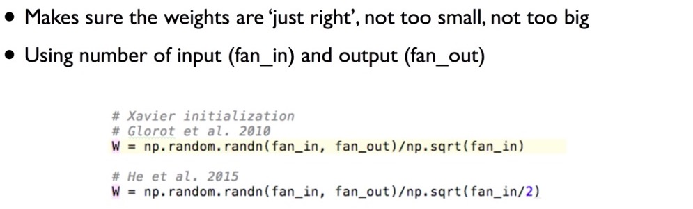
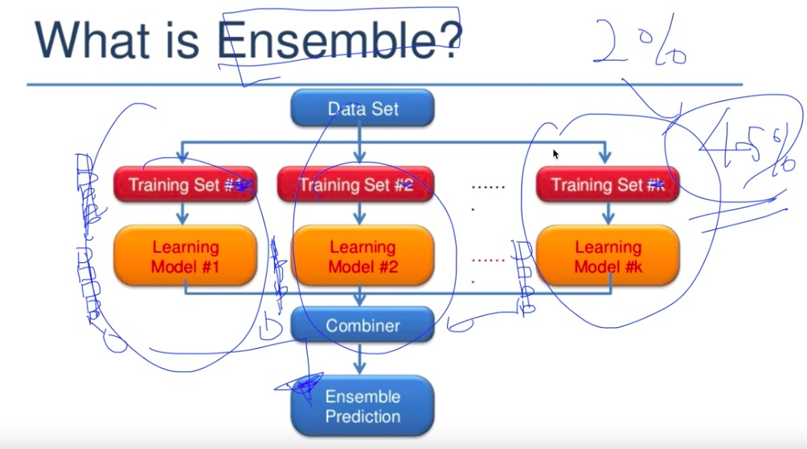

# neural network

> perceptron에서는 가중치를 인간이 직접 설정해줬었다면, neural network에서는 가중치 매개변수의 적절한 값을 데이터로부터 자동으로 학습하는 능력을 갖춘다
>
> 단순 perceptron은 단층 네트워크에서 계단함수(임계값을 경계로 출력이 바뀌는 함수)를 활성함수로 사용한 모델을 가리키고, 다층 perceptron은 neural network(여러 층으로 구성되고 시그모이드 함수 등의 매끈한 활성화 함수를 사용하는 네트워크)을 가리킨다. 그리고 활성화 함수를 계단 함수에서 다른 함수(예를 들어 시그모이드 함수)로 변경하는데, 이것이 neural network의 시작 !
>

</br>

## Deep Learning 배경

단층 perceptron은 그래프에서 선형 함수라고 생각하면 이해하기 쉽다

perceptron을 활용해 AND, NAND, OR gate까지는 만들었는데, XOR이 안만들어진다 ? 

-> Marvin Minsky 왈(1969년, 첫번째 침체기) : 다층 perceptron(neural net의 시작)으로 가능하다. 그런데 문제는 Weight와 bias학습을 못시킨다(학습을 통해 W와 b가 갱신되어야 하는데, 이 때 필요한 미분을 구하기가 어려워서).

-> Hinton왈 (1986년) : Back propagation(chain rule)이면 가능하다 !(즉 nerual net에서 미분을 구하는 방법)

-> neural network가 deep해지면 Backpropagaton방법으론 앞단 쪽으로 갈 수록 에러가 전달이 잘 되지 않아 학습이 어려워진다. **vanishing gradient**(1995년, 두번째 침체기)

-> Hinton, Bengio (2006, 2007) : Weight를 초기화 잘한다면 가능해 !

</br>

**DNN에서 학습 잘 안된 이유들 by Hinton**

* weight 초기화 잘못했다

- labeled datasets이 너무 작다

- 컴퓨터 성능이 너무 느리다

- 잘못된 non-linearity방식을 사용했다(Sigmoid : X, ReLU : O)


</br>

## neural network의 구조

input layer - hidden layer - ouput layer

</br>

## neural network 잘 작동하려면?


### 1. activation 함수를 잘 선택해 vanishing gradient 없애자 ! 

</br>

nn의 학습 방식은 back propagation으로 이루어지는데, 이 때 gradient(변화량, 기울기)는 activation function을 거친 값과 곱해지는 경우가 많다(항상 그런 것은 아니다. + node로만 이루어진 경우는 vanishing gradient 안일어난다. 내 생각). 그런데 각 layer마다 activation function은 sigmoid 함수로 존재하고, 이 함수는 0~1 사이의 값을 갖기 때문에 layer가 깊어 질 수록 gradient에 작은 값들이 곱해져 0에 가깝게 된다. 따라서 각각의 결과에 대한 weight 영향력(df/dw)은 소실 되어 제대로 갱신이 되지 않게 되고, nn은 학습이 잘 이루어지지 않는다


</br>

#### ReLU

hidden layer가 많은 상황에서 sigmoid를  사용하게 되면, 뒤의 미분값과 0~1(sigmoid의 결과, actiovation function)의 값이 계속해서 곱해지기 때문에 가장 앞부분 layer로 도달할 수록 input은 최종 output에 미미한 영향을 주게 된다. 따라서 이를 막기 위해 0보다 큰 값에 한해서는 그 값의 영향을 남겨두자는 취지로 ReLU function을 activation function으로 사용한다

하지만  가장 마지막단은 0~1 사이로 출력을 해야하기 때문에 sigmoid를 사용한다


</br>

### 기타 activation function


</br>

#### 2. Weight 초기화 잘하기

가중치의 초기값을 작게 만들고 싶다고 0으로 설정한다면?

안된다. 정확히는 0보다 가중치를 균일한 값으로 설정하게 되면 back propagation에서 모든 가중치의 값이 똑같이 갱신되기 때문


각 층의 활성화값들을 광범위하게 분포시킬 목적으로 가중치의 적절한 분포를 찾고자 한다. 왜냐하면 각 층의 다수의 뉴런이 출력하는 값이 한 쪽에 집중되어 있다면 표현력 관점에서 큰 문제가 있기 때문이다. 이는 뉴런을 하나만 두는 것과 다를 바가 없다


</br>

**RBM**

Restricted Boatman Machine, weight의 초기값을 잘 주는 방법으로 Deep Belief Network에 쓰임

기존의 방법은 W(weight)에 랜덤 값을 주어서, 모델을 학습시켰다. 하지만 W값을 초기에 얼마나 잘 주느냐에 따라 학습 속도가 달라지기 때문에 좋은 초기값을 정해주는 것은 중요하다


두개의 인접한 layer에만 초점을 맞춘다. x값을 통해 어떤 결과 값이 나온다면 backword 방향으로 그 결과 값을 이용해 기존의 x와 가장 유사한 값이 나올 수 있도록 weight를 설정한다.

이와 같은 방법으로 모든 인접한 레이어 사이의 weight를 결정한다

하지만 RBM을 구해 적용하는 것 자체에 어려움이 따른다…따라서 보다 간단한 Xaivier initialization이나 He's initialization을 사용한다. 초기화 방법에는 다양한 방법들이 있지만 data에 따라 최적의 방법이 다르다. 아직 연구중인 단계


</br>

### Xavier/He initialization

- Xavier

  앞층의 node가 n개라면 표준편차가 1/루트n 인 분포를 사용한다

  activation function이 좌우 대칭일 경우(sigmoid, tanh)에 xavier 사용(mnist 분류할 때, ReLU랑 xavier사용 했던데?)


- He

  앞층의 node가 n개라면 표준편차가 2/루트n인 분포를 사용한다

  activation function이 ReLU일 때 He 사용





</br>


### Batch Normalization

> 각 층의 활성화값 분포가 적당히 퍼져야 학습이 원할하게 수행되는데, 이를 '강제'하는 방법
>
> mini batch 입력 데이터를 평균 0, 분산 1인 데이터로 변환한다


</br>

장점

- 학습을 빨리 진행할 수 있다
- 초기값에 크게 의존하지 않는다(weight 초기값 선택에 크게 영향 안받을 수 있음)
- 오버피팅을 억제한다(drop out 필요성 감소)


</br>

위의 2개는 hinton의 문제점을 극복한 것이고, 이외 몇 가지 방법을 더 소개하자면

###3. Overfitting 줄이자 ! Regularization

</br>

#### regularization(가중치 감소 방법)

> 가중치가 클 수록 패널티를 적용해 가중치를 감소(weight decay)시키는 방법으로 overfitting을 줄이는 효과 있다

weight 벡터의 제곱의 합을 regurlarization strength만큼 곱해 더하는 방법(l2reg)이다. regurlaization을 적용하지 않는다면 regurlarization strength 값을 작게 하고, 중요하게 생각한다면 크게 한다


</br>

tensorflow에서 사용법

```python
l2reg = 0.001 * tf.reduce_sum(tf.square(W))
```


</br>

#### Drop out

> 이는 훈련층에서 기존의 몇 개의 노드를 임의로 없애버리고 training하겠다는 것. training할 때마다 임의로 선정한 몇 개의 노드를 무시한채로 training(학습시)하고, 마지막 평가(실전 test용)할 때는 모든 노드를 포함한다(훈련 때 삭제한 비율을)


모델이 깊어지는 경우 overfitting일어나기도 한다. 이 때, overfitting을 막기 위해선 regularization을 하는데, 신경망 모델이 복잡해지면 가중치 감소만으로는 대응하기 어려운 경우가 있다. 이럴 때 흔히 drop out이라는 방법을 사용한다. 여러 개의 모델이 있는 neual network에서 적용되는 방법이다.


</br>

- 주의

  학습시에만 drop out을 적용하고, 실전 평가에서는 drop out을 하지 않는다

  train : dropout_rate = 0.7(대개 0.5)

  evaluate : dropout_rate = 1 !!!

  tensorflow 1.0 이후 부터 dropout_reate 대신 keep_prob으로 설정해준다. 얼만큼 노드를 살릴것인지


  ```python
  L1 = tf.nn.dropout(L1, keep_prob=keep_prob)
  ```


</br>


#### Ensemble

> 초기값이 서로 다른 몇 개의 모델을 통해 학습 시킨 후 나온 예측값을 조합해 예측하는 방법. 평가율이 2% ~ 5%까지 올라간다. 앙상블 학습은 드롭아웃과 밀접하다. 드롭아웃은 앙상블 학습과 같은 효과를 (대략) 하나의 네트워크로 구현했다고 생각할 수 있다. data set이 많을 때 주로 사용





</br>

###4. optimizer 선택

optimizer마다 장단점이 있기 때문에 모델 마다 다른 optimizer를 사용한다. 대개 SGD와 adam을 많이 사용한다


back propagation은 노드들의 loss값에 대한 가중치의 기울기를 구하는 과정이다. 그리고 이렇게 구해진 기울기를 adam과 같은 optimizer를 통해서 최적화 시켜주는 것

</br>

### SGD (stochastic gradient descent)

SGD는 기울기가 하강하는 방향으로 이동하여 매개변수를 갱신하는 방법. 단순하고 구현하는 방법도 쉽지만, 비등방성(anisotropy) 함수(방향에 따라 기울기가 달라지는 함수)에서는 탐색 경로가 비효율적. 또한 어떤 함수에 대해서는 지그재그로 탐색하는 경우도 있음

</br>

### momentum

어떤 함수에 대해 SGD보다 덜 지그재그로 탐색함

</br>

### adaGrad

매개변수를 갱신할 때마다 학습률을 조정(더 작게)한다. 매개변수의 원소 중에서 많이 움직인 원소는 학습률이 낮아진다는 뜻인데, 다시 말해 학습률 감소가 매개변수의 원소마다 다르게 적용된다는 것. 지그재그 효과 줄일 수 있음

</br>

### adam

momentum과 adaGrad의 융합 방법. 편향 보정이 진행된다. 


```python
optimizer = tf.train.AdamOptimizer(learning_rate=learning_rate).minimize(cost)
```


</br>

## 


</br>

## additional


### 비선형 함수

neural network에서는 activation function으로 비선형 함수를 사용한다. 이유는 선형 함수(y=ax + b)를 사용할 경우 그것은 hidden layer가 없는 구조로도 충분히 만들 수 있기 때문이다. 그럼 층을 쌓는 neural network를 사용할 이유가 없음

</br>

### activation function

* Sigmoid

  ```python
  def sigmoid(x):
  	return 1 / (x + np.exp(-x))
  ```

  2클래스 분류에 쓰임

</br>

* Relu(Recitified Linear Unit)

  h(x) = x (x > 0)

  	= 0 (x <= 0)

  ```python
  def Relu(x):
      return np.maximum(0, x)
  ```

</br>

**sigmoid의 문제점**

* 항등 함수(출력층, 주로 regression에서)

  입력을 그대로 출력

  회귀에 쓰임

</br>

* softMax(출력층, 주로 classification)

  

  

  

  다중 클래스 분류에 쓰임

  출력층의 각 뉴런이 모든 입력 신호에서 영향을 받는다

  overflow(컴퓨터가 표현할 수 있는 값을 넘는 현상)를 막기 위해 exp 지수값에서 -C(입력값의 최대치) 해준다

  출력의 총 합은 1이다 (중요) -> 함수의 출력을 '확률'로 계산 가능

  기계학습의 문제 풀이는 **학습**과 **추론(예측하는 것, 회귀 or 분류)**의 두 단계를 거친다. neural network도 마찬가지인데, 추론 단계에서 분류 할 때, softmax function은 없어도 된다. softmax function 단조 함수라 적용해도 입력 원소의 대소 관계는 변하지 않기 때문이다. 따라서 현업에서도 계산에 드는 자원 낭비를 줄이고자 추론 단계에서 출력층의 softmax function은 생략하는 것이 일반적이다(학습 단계에서는 softmax 사용)

</br>

### 행렬의 곱

주의 !

```python
A = np.array([[1,2],[3,4],[5,6]])
A.shape		# (3,2)
B = np.array([7,8])
B.shape		# (2,)....이것은 (2,1)도 아니고, (1,2)가 아니다...따라서 둘의 곱 가능

np.dot(A, B).shape	# (3,)....

C = np.array([[1,2],[3,4]])
C.shape 	# (2,2)

np.dot(B, C).shape	# (2,)...가능...왜냐 B의 shape이 2이기 때문. 이것은 (2,1)도 아니고 (1,2)도 아니다. 또는 둘 다이기도 하다
```

