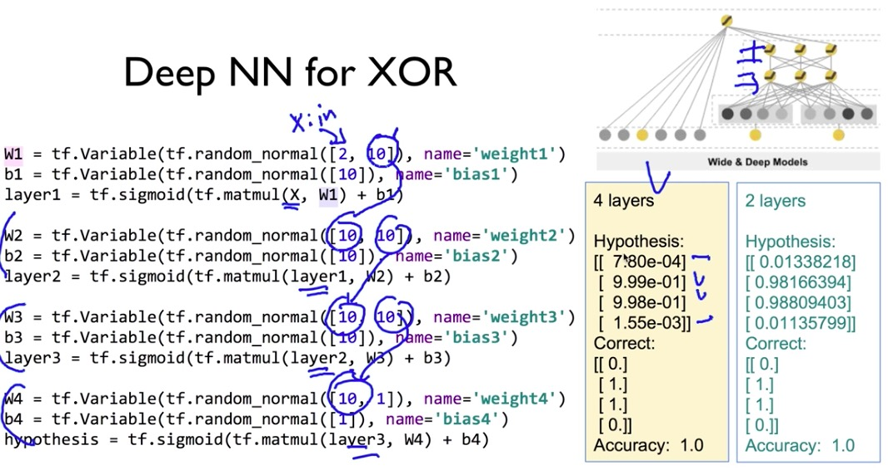

## perceptron

다수의 신호를 입력으로 받아 하나의 신호를 출력

단층 perceptron은 그래프에서 선형 함수라고 생각하면 이해하기 쉽다

perceptron을 활용해 AND, NAND, OR gate까지는 만들었는데, XOR이 안만들어진다 ? -> 다층 perceptron(neural net의 시작)

## XOR

> XOR 도 hypothesis로 만들 수 있을까?
>
> 단층 perceptron으론 XOR gate만들 수 없다!

* truth table

하나만으론 안된다. 그래서 세개로 표현했더니 가능 !

실제로 4개의 데이터로 layer1만으로 10000번 돌리면 accuracy : 50% 였던게 layer2를 합쳤을 때 accyracy : 100% 나온다

그것이 바로 neural network. layer1의 두 개를 합쳐서 하나로 표현해도 무방

W1, W2, W3,에서 출력부분에 아무 값(10)이나 집어 넣는다. 그런데 정말 아무 값일까...?
