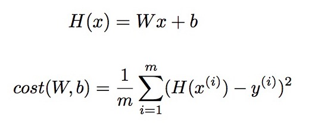
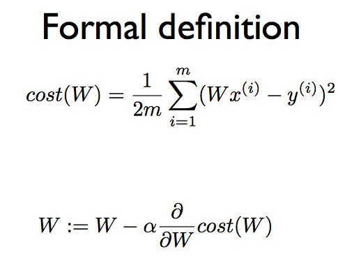
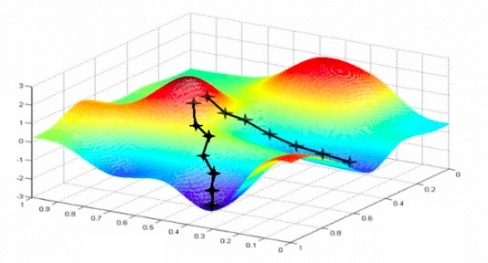
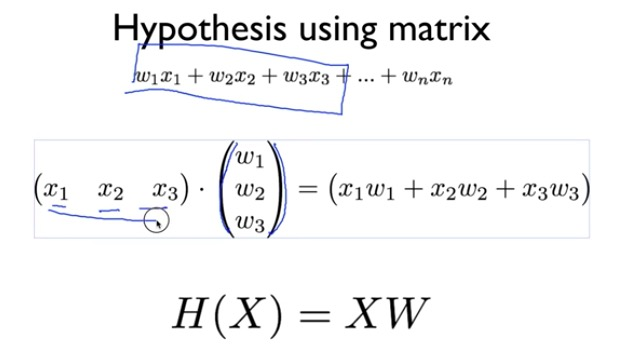
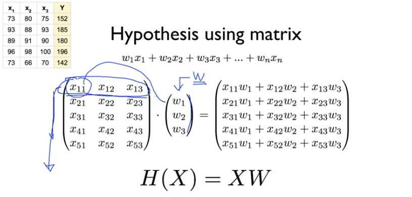

# machine learning

### Supervised / Unsupervised learning

supervised - : learning with labeled examples - training set

* regression
* classification(binary or multi-label)

unsupervised - : learning with un-labeled examples

### Linear Regression의 cost 최소화 알고리즘

cost(W)를 미분한 값은 곧 cost(W)의 기울기이고 이것이 음수일 때 W는 커져야 한다. 반대로 이것이 양수일 때 W는 작아져야 한다

하지만 cost function의 convex fuction이 다음과 같을 경우에는 gradient decent alrorithm을 사용할 수 없기 때문에 항상 적용 전 확인해보아야 한다

* 불가능한 경우

* 가능한 경우(어느 점에서 시작해도 가장 작은 값 동일)

**linear regression 구성 요소**

**multi variable일 때**

