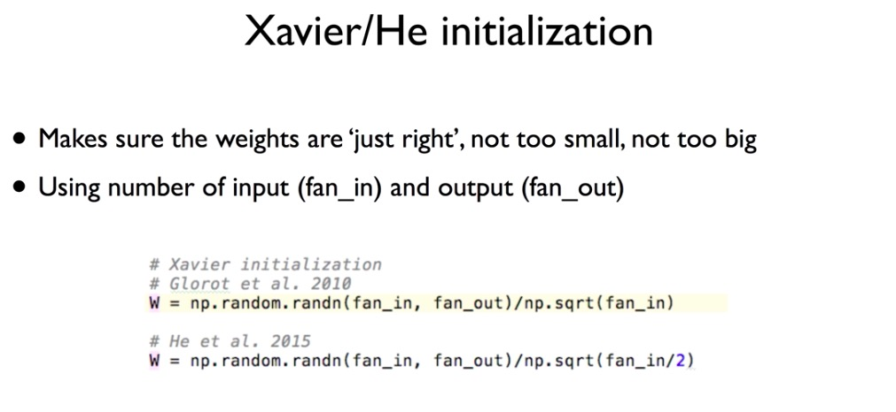

# ReLU & RBM

##ReLU

>  recitified linear unit

### sigmoid의 문제점, vanishing gradient

hidden layer가 많은 상황에서 sigmoid를  사용하게 되면, 뒤의 미분값과 0~1(sigmoid의 결과, actiovation function)의 값이 계속해서 곱해지기 때문에 가장 앞부분 layer로 도달할 수록 input은 최종 output에 미미한 영향을 주게 된다

하지만  가장 가지막단은 0~1 사이로 출력을 해야하기 때문에 sigmoid를 사용한다

* layer는 input layer(input가 연결되어 있는), hidden layer(중간), output layer(output가 연결되어 있는)로 구분한다

### solution

0보다 큰 값에 한해서는 그 값의 영향을 남겨두자는 취지로 ReLU function 도입

## RBM

> Restricted Boatman Machine, weight의 초기값을 잘 주는 방법으로 Deep Belief Network에 쓰임

기존의 방법은 W(weight)에 랜덤 값을 주어서, 모델을 학습시켰다. 하지만 W값을 초기에 얼마나 잘 주느냐에 따라 학습 속도가 달라지기 때문에 좋은 초기값을 정해주는 것은 중요하다

두개의 인접한 layer에만 초점을 맞춘다. x값을 통해 어떤 결과 값이 나온다면 backword 방향으로 그 결과 값을 이용해 기존의 x와 가장 유사한 값이 나올 수 있도록 weight를 설정한다.

이와 같은 방법으로 모든 인접한 레이어 사이의 weight를 결정한다

하지만 RBM을 구해 적용하는 것 자체에 어려움이 따른다…따라서 보다 간단한 Xaivier initialization이나 He's initialization을 사용한다. 초기화 방법에는 다양한 방법들이 있지만 data에 따라 최적의 방법이 다르다. 아직 연구중인 단계

