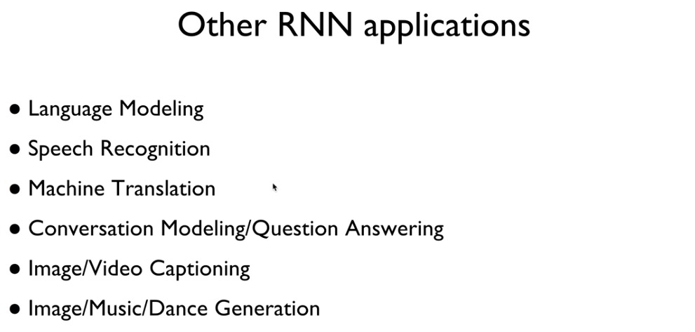

# recurrent neural network

sequence data를 활용한다

흔히 왼쪽과 같이 RNN을 표현하지만 이는 여러개의 동일한 function이 합쳐져 있음을 나타낸다

* RNN 구조

#### notice

the same function and the same set of parameters are used at every time step

* Vanilla

자동완성 기능에도 RNN이 쓰이는데, 이를 예를들어 보면

* RNN 적용 사례

one to one : vanilla neral network

one to many : image -> equence of words, ex) image captioning

many to one :  sequence of words -> sentiment, ex) sentiment classification(해당 문장 표현의 담긴 감정 분류)

many to many : sequence of words - sequence of words, ex) machine translation

many to many : ex) video classification on frame level

RNN도 multi layer를 적용해 accuracy를 높일 수 있다

RNN보다는 LSTM, GRU이 많이 쓰인다

### tensorflow에서

shape을 보면, (batch_size, sequence_length, hidden_size)

batch_size는 한 batch에 몇 개의 data를 줄 것인지(몇개의 문자열을 줄것인지)

sequence_length는 입력이 몇 개인지(문자열의 길이)

hidden_size는 임의로 설정해주는 값

### sequence가 길다면?

sequence가 긴 경우 accuracy가 낮아지는데, 이 때 rnn의 층을 깊고 넓게 만들어 준다. 그리고 cnn에서와 마찬가지로 마지막 layer를 fully connected layer로 softmax 한다

중요한 점은, logits 값에 output을 넣어 줄 때, activation function을 거치지 않은 값을 넣어주는 것이 바람직하다. 이전의 코드에선 rnn의 output을 logits값으로 넣었는데 이는 activation function을 거친 이후이기 때문에 결과가 제대로 나오지 못했다. 따라서 fc layer(softMax)의 output(actiation function을 거치지 않은 상태)을 logits으로 넣어준다

### sequence 길이가 다 제각각 이라면?

dynamic rnn 활용한다. 이 때 sequence_length만 임의의로 지정해준다면, 지정해준 값을 제외한 나머지는 0으로 출력되어 나온다

### 시간에 따라 변하는 data라면?

time series data : 시간에 따라 값이 변하는 data

#### ex) 주식 가격

input data는 다섯 가지(open, high, low, volume, close)

data의 sequence는 7(day1 ~ day7, day8을 예측)

output은 1(day8의 close가격)

#### RNN 적용

