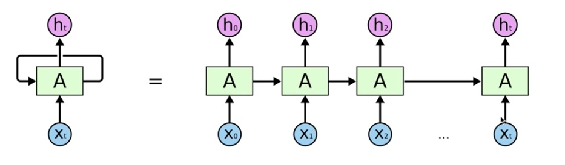
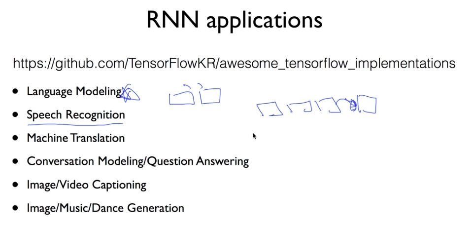

# recurrent neural network

sequence data를 활용한다

흔히 왼쪽과 같이 RNN을 표현하지만 이는 여러개의 동일한 function이 합쳐져 있음을 나타낸다

* RNN 구조

#### notice

the same function and the same set of parameters are used at every time step

* Vanilla

자동완성 기능에도 RNN이 쓰이는데, 이를 예를들어 보면

* RNN 적용 사례

one to one : vanilla neral network

one to many : image -> equence of words, ex) image captioning

many to one :  sequence of words -> sentiment, ex) sentiment classification(해당 문장 표현의 담긴 감정 분류)

many to many : sequence of words - sequence of words, ex) machine translation

many to many : ex) video classification on frame level

RNN도 multi layer를 적용해 accuracy를 높일 수 있다

RNN보다는 LSTM, GRU이 많이 쓰인다

### tensorflow에서

shape을 보면, (batch_size, sequence_length, hidden_size)

batch_size는 한 batch에 몇 개의 data를 줄 것인지

sequence_length는 입력이 몇 개인지(여기선 문자열의 길이)

hidden_size는 임의로 설정해주는 값

